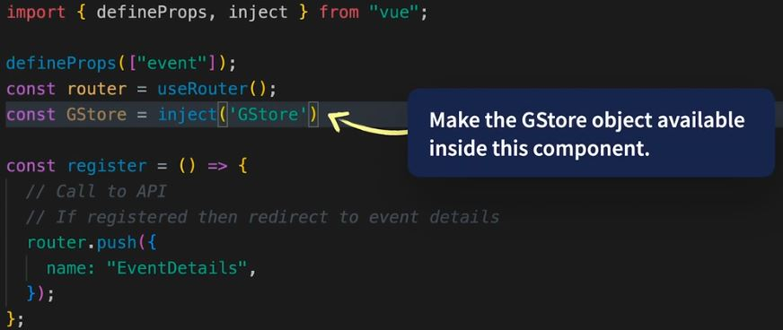
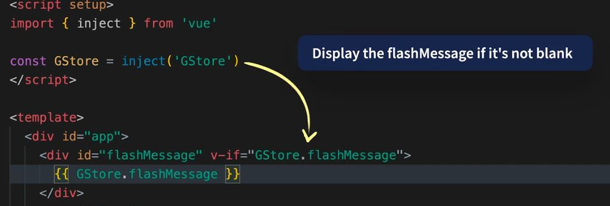

# VUE HAND NOTE 🚀

> A hand note of my vue js journey.....

<br>
<div align="center"> 

| Key Note                    |                      |                |                       |
|-----------------------------|----------------------|----------------|-----------------------|
| **Emoji**                    | **Description**          | **Emoji**   | **Description**       |
| 🌴                           | **Main Topic**       | 🏷️              | **Regular Note**      |
| 🌿                           | **Main Category**        | 📌            | **Regular Note**    |
| 🍃                          | **Sub Category**       | 💎            | **High Value info**      |
| 🍂                          | **Sub-sub Category**   | ✋             | **Stop! check the point** |
| 🎈                           | **Step**     | 🎯             | **Focus**             |

</div> 

<!-- NO COMMENT -->

<!-- 
1. Vue.js Core Concepts:
 •	1.1 Vue Instance: Understanding the Vue instance, data, methods, computed properties, and lifecycle hooks.
 •	1.2 Components: Creating and managing components, props, events, slots.
 •	1.3 Vue Directives: v-bind, v-if, v-for, v-on, etc.
 •	1.4 Reactivity: Understanding Vue's reactivity system.
2. Vue Router:
 •	2.1 Routing: Implementing client-side routing using Vue Router.
 •	2.2 Nested Routes: Configuring nested routes and handling dynamic routes.
3. Vuex (State Management):
 •	3.1 State: Managing application-level state using Vuex.
 •	3.2 Mutations & Actions: Changing state through mutations and asynchronous actions.
 •	3.3 Getters: Computing derived state.
4. API Integration:
 •	4.1 Axios/Fetch: Making HTTP requests to APIs.
 •	4.2 Handling Responses: Managing API responses and integrating them into Vue components.
5. Advanced Vue.js Topics:
 •	5.1 Custom Directives: Creating custom directives for specific DOM manipulations.
 •	5.2 Mixins: Reusing component logic.
 •	5.3 Render Functions and JSX: Understanding and using render functions for more complex UI requirements.
6. Testing:
 •	6.1 Unit Testing: Writing unit tests for Vue components using testing libraries like Jest or Vue Test Utils.
 •	6.2 End-to-End Testing: Using tools like Cypress for testing the entire application flow.
7. Tooling:
 •	7.1 Vue CLI: Setting up projects using the Vue CLI and understanding its features.
 •	7.2 DevTools: Using browser extensions or Vue DevTools for debugging and inspecting Vue applications.

 -->

## Table of Contents
[🌴 1. Vue.js Core Concepts](#-vue.js-core-concepts)
- [🌿 1.1 Vue Instance](#vue-instance)
  - [🍃 1.1.1 Data](#-111-data)
    - [🍂 1.1.1.1 Reactive Data](#-1111-reactive-data)
    - [🍂 1.1.1.2 Reactivity in Vue](#-1112-reactivity-in-vue)
    - [🍂 1.1.1.3 Accessing Data in Templates](#-1113-accessing-data-in-templates)
    - [🍂 1.1.1.4 Changing Data](#-1114-changing-data)
    - [🍂 1.1.1.5 Caveats with Reactivity](#-1115-caveats-with-reactivity)   
  - [🍃 1.1.2 Methods](#-112-methods)
    - [🍂 1.1.2.1 Declaring Methods](#-1121-declaring-methods)
    - [🍂 1.1.2.2 Accessing Methods in Templates](#-1122-accessing-methods-in-templates)
    - [🍂 1.1.2.3 Method Scope and this Context](#-1123-method-scope-and-this-context)
    - [🍂 1.1.2.4 Parameters in Methods](#-1124-parameters-in-methods) 
    - [🍂 1.1.2.5 Method Lifecycle Hooks](#-1125-method-lifecycle-hooks) 
  - [🍃 1.1.3 Computed Properties](#-113-computed-properties)
    - [🍂 1.1.3.1 Declaration of Computed Properties](#-1131-declaration-of-computed-properties) 
    - [🍂 1.1.3.2 Usage in Templates](#-1132-usage-in-templates)
    - [🍂 1.1.3.3 Characteristics of Computed Properties](#-1133-characteristics-of-computed-properties)
    - [🍂 1.1.3.4 Computed Properties vs. Methods](#-1134-computed-properties-vs-methods)  
  - [🍃 1.1.4 Lifecycle Hooks](#-114-lifecycle-hooks)
- [🌿 1.2 Components](#-12-components)
  - [🍃 1.2.1 Component Structure](#-121-component-structure)
  - [🍃 1.2.2 Porps (Custom Attibutes)](#-122-porps-custom-attibutes)
  - [🍃 1.2.3 Events (Custom Event Handling)](#-123-events-custom-event-handling)
  - [🍃 1.2.4 Slots (Content Distribution)](#-124-slots-content-distribution)
- [🌿 1.3 Vue Directives](#-13-vue-directives)
  - [🍃 1.3.1 v-bind Directive](#-131-v-bind-directive)
  - [🍃 1.3.2 v-if and v-else Directives](#-132-v-if-and-v-else-directives)
  - [🍃 1.3.3 v-for Directive](#-133-v-for-directive)
  - [🍃 1.3.4 v-on Directive](#-134-v-on-directive)
  - [🍃 1.3.5 v-model Directive](#-135-v-model-directive)
  - [🍃 1.3.6 v-show Directive](#-136-v-show-directive)
  - [🍃 1.3.7 v-pre, v-cloak, v-once Directives](#-137-v-pre-v-cloak-v-once)
- [🌿 1.4 Reactivity: Understanding Vue's reactivity system](#-14-reactivity-understanding-vues-reactivity-system)
- [🌴 2. Vue Router](#-2-vue-router)
  - [🌿 2.1 Installation and Setup](#-step-1-installation-and-setup)
  - [🌿 2.2 Configuration](#-step-2-configuration)
  - [🌿 2.3 Integrate the Router in your main Vue instance](#-step-3-integrate-the-router-in-your-main-vue-instance)
  - [🌿 2.4 Creating Route Components](#-step-4-creating-route-components)
  - [🌿 2.5 Navigating between Routes](#-step-5-navigating-between-routes)
  - [🌿 2.6 Route Parameters and Dynamic Routes](#-step-6-route-parameters-and-dynamic-routes)
  - [🌿 2.7 Programmatic Navigation](#-step-7-programmatic-navigation)
  - [🌿 2.8 Nested Routes](#-step-8-nested-routes)
  - [🌿 2.9 Route Guards](#-step-9-route-guards)
  - [🌿 2.10 Dynamic Route Matching](#-step-10-dynamic-route-matching)
  - [🌿 2.11 Route Transitions](#-step-11-route-transitions)
  - [🌿 2.12 Navigation Guards in Component Options](#-step-12-navigation-guards-in-component-options)
  - [🌿 2.13 Named Views](#-step-13-named-views)
  - [🌿 2.14 Navigation Events](#-step-14-navigation-events)
  - [🌿 2.15 Lazy Loading Routes](#-step-15-lazy-loading-routes)
  - [🌿 2.16 Navigation Duplicates](#-step-16-navigation-duplicates)
  - [🌿 2.17 Scroll Behavior](#-step-17-scroll-behavior)
  - [🌿 2.18 Error Handling](#-step-18-error-handling)
  - [🌿 2.19 Hash Mode](#-step-19-hash-mode)
  - [🌿 2.20 Nested Routing [From My Learning....]](#-nested-routing-from-my-learning)

   
- [🌴 For setting up the project](#-for-setting-up-the-project)
- [🌴 Setting up the development environment](#-setting-up-the-development-environment)
- [🌴 Project structure](#-project-structure)
- [🌴 Showing Data from variable to template](#-showing-data-from-variable-to-template)
- [🌴 Showing data from Object](#-showing-data-from-object)

- [🌴 Vue Router](#-vue-router)
  - [👉 Step 1: Installation and Setup](#-step-1-installation-and-setup)
  - [👉 Step 2: Configuration](#-step-2-configuration)
  - [👉 Step 3: Integrate the Router in your main Vue instance](#-step-3-integrate-the-router-in-your-main-vue-instance)
  - [👉 Step 4: Creating Route Components](#-step-4-creating-route-components)
  - [👉 Step 5: Navigating between Routes](#-step-5-navigating-between-routes)
  - [👉 Step 6: Route Parameters and Dynamic Routes](#-step-6-route-parameters-and-dynamic-routes)
  - [👉 Step 7: Programmatic Navigation](#-step-7-programmatic-navigation)
  - [👉 Step 8: Nested Routes](#-step-8-nested-routes)
  - [👉 Step 9: Route Guards](#-step-9-route-guards)
  - [👉 Step 10: Dynamic Route Matching](#-step-10-dynamic-route-matching)
  - [👉 Step 11: Route Transitions](#-step-11-route-transitions)
  - [👉 Step 12: Navigation Guards in Component Options](#-step-12-navigation-guards-in-component-options)
  - [👉 Step 13: Named Views](#-step-13-named-views)
  - [👉 Step 14: Navigation Events](#-step-14-navigation-events)
  - [👉 Step 15: Lazy Loading Routes](#-step-15-lazy-loading-routes)
  - [👉 Step 16: Navigation Duplicates](#-step-16-navigation-duplicates)
  - [👉 Step 17: Scroll Behavior](#-step-17-scroll-behavior)
  - [👉 Step 18: Error Handling](#-step-18-error-handling)
  - [👉 Step 19: Hash Mode](#-step-19-hash-mode)
  - [🌿 Nested Routing [From My Learning....]](#-nested-routing-from-my-learning)

  
- [🌴 Building Pagination](#-building-pagination)
- [🌴 Pagination Step 01 - Parse & set the current page from the router using Funciton Mode](#-Pagination-Step-01---Parse-&-set-the-current-page-from-the-router-using-Funciton-Mode)
- [🌿 Nested Routing](#-nested-routing)

<br>

## 🌴 1. Vue.js Core Concepts
## 🌿 1.1 Vue Instance

Understanding the Vue instance, data, methods, computed properties, and lifecycle hooks. <br>
The Vue instance is at the core of Vue.js and serves as the root of every Vue application. It's responsible for managing the data, methods, computed properties, and lifecycle hooks of your Vue components.<br>

**Vue Instance Creation:**
To create a Vue instance, you typically initialize it with a configuration object using the ``` new Vue() ``` constructor. <br>

```
var app = new Vue({
  // Options
});

```
## 🍃 1.1.1 Data:
**[`Back to top ⬆️`](#table-of-contents)**

The data property within the Vue instance holds the application's data. Vue.js ensures that any changes made to this data are reactive, meaning changes automatically update the corresponding parts of the UI.

Example:
```
var app = new Vue({
  data: {
    message: 'Hello, Vue!'
  }
});

```
<br>

💎 In Vue.js, the data property within a Vue instance holds the application's reactive data. Understanding how data works within Vue is crucial as it forms the basis for building reactive and dynamic applications.

```
var app = new Vue({
  data: {
    message: 'Hello, Vue!',
    items: ['apple', 'banana', 'orange'],
    user: {
      name: 'John Doe',
      age: 25
    }
  }
});

```
### 🍂 1.1.1.1 Reactive Data
**[`Back to top ⬆️`](#table-of-contents)**

The data property in a Vue instance defines the initial state of the application's data. Vue's reactivity system ensures that any changes made to this data are automatically reflected in the UI where that data is used.

```
var app = new Vue({
  data: {
    message: 'Hello, Vue!',
    items: ['apple', 'banana', 'orange'],
    user: {
      name: 'John Doe',
      age: 25
    }
  }
});

```
### 🍂 1.1.1.2 Reactivity in Vue
**[`Back to top ⬆️`](#table-of-contents)**
When properties are added or modified within the data object, Vue automatically detects these changes and updates the associated components in the DOM.

Example:

```
app.message = 'Greetings, Vue!';
app.items.push('grapes');
app.user.age = 26;

```
### 🍂 1.1.1.3 Accessing Data in Templates
**[`Back to top ⬆️`](#table-of-contents)**

You can access data properties directly within Vue templates using the double curly braces {{ }} syntax.

Example:
```
<div>
  <p>{{ message }}</p>
  <ul>
    <li v-for="item in items">{{ item }}</li>
  </ul>
  <p>Name: {{ user.name }}, Age: {{ user.age }}</p>
</div>

```
### 🍂 1.1.1.4 Changing Data
**[`Back to top ⬆️`](#table-of-contents)**
To modify data within Vue instances, you should use Vue's reactivity system by directly changing the properties. This ensures that the changes are reactive and trigger the necessary updates in the UI.

Example:

```
app.message = 'Updated message'; // Reactive change
app.items.push('new item'); // Reactive change

```
### 🍂 1.1.1.5 Caveats with Reactivity
**[`Back to top ⬆️`](#table-of-contents)**

It's important to note that Vue cannot detect property addition or deletion after the initial creation of the instance. To add or remove properties dynamically, use Vue.set or this.$set for object properties and splice for array elements.

Example:

```
Vue.set(app.user, 'address', '123 Main St');
// or
this.$set(this.user, 'address', '123 Main St');

// Removing an item from an array
app.items.splice(index, 1);

```

## 🍃 1.1.2 Methods:
**[`Back to top ⬆️`](#table-of-contents)**
The methods property contains methods that can be used within the Vue instance. These methods can manipulate data or perform other tasks triggered by user actions or lifecycle events.

Example:
```
var app = new Vue({
  data: {
    count: 0
  },
  methods: {
    increment() {
      this.count++;
    },
    decrement() {
      this.count--;
    }
  }
});

```

💎 In Vue.js, the methods property within a Vue instance contains methods that can be used within the instance's scope. These methods enable you to perform various tasks, manipulate data, handle events, and more within your Vue components.

### 🍂 1.1.2.1 Declaring Methods
**[`Back to top ⬆️`](#table-of-contents)**

Methods are defined within the methods object of the Vue instance, using key-value pairs where the key is the method name and the value is the function.

Example:

```
var app = new Vue({
  data: {
    count: 0
  },
  methods: {
    increment() {
      this.count++;
    },
    decrement() {
      this.count--;
    },
    greet(name) {
      return 'Hello, ' + name + '!';
    }
  }
});

```
### 🍂 1.1.2.2 Accessing Methods in Templates
**[`Back to top ⬆️`](#table-of-contents)**

You can call these methods directly from your Vue templates by using Vue's event handling directives (v-on or @ shorthand).

Example:

```
<div>
  <p>Count: {{ count }}</p>
  <button @click="increment">Increment</button>
  <button @click="decrement">Decrement</button>
  <p>{{ greet('Vue') }}</p>
</div>

```
### 🍂 1.1.2.3 Method Scope and this Context
**[`Back to top ⬆️`](#table-of-contents)**

In Vue methods, this refers to the Vue instance itself, giving you access to the instance's data, methods, and lifecycle hooks.

```
var app = new Vue({
  data: {
    message: 'Hello, Vue!'
  },
  methods: {
    showMessage() {
      // Accessing data from the Vue instance
      alert(this.message);
    }
  }
});

```
### 🍂 1.1.2.4 Parameters in Methods
**[`Back to top ⬆️`](#table-of-contents)**

You can pass parameters to Vue methods when they are called from the template. These parameters can be accessed within the method's function body.

```
// html
<div>
  <button @click="greet('World')">Greet World</button>
</div>

```
```
// javascript

methods: {
  greet(name) {
    alert('Hello, ' + name + '!');
  }
}

```

### 🍂 1.1.2.5 Method Lifecycle Hooks
**[`Back to top ⬆️`](#table-of-contents)**

Vue also provides certain lifecycle hooks where you can define custom methods to be executed at specific stages of a Vue instance's lifecycle, such as created, mounted, updated, and destroyed.

Example:

```
var app = new Vue({
  data: {
    message: 'Hello, Vue!'
  },
  created() {
    console.log('Vue instance created');
  },
  mounted() {
    console.log('Vue instance mounted to the DOM');
  },
  destroyed() {
    console.log('Vue instance destroyed');
  }
});

```

## 🍃 1.1.3 Computed Properties:
**[`Back to top ⬆️`](#table-of-contents)**

The computed property allows you to define properties that are derived from the Vue instance's data. Computed properties are cached and only re-computed when their dependencies change.

Example:

```
var app = new Vue({
  data: {
    radius: 5
  },
  computed: {
    circleArea() {
      return Math.PI * Math.pow(this.radius, 2);
    }
  }
});

```
💎 Computed properties in Vue.js are properties that are derived from the Vue instance's data and are calculated based on dependencies. They allow you to perform complex logic and calculations on your data in a way that is reactive—meaning these properties update automatically when their underlying dependencies change.

### 🍂 1.1.3.1 Declaration of Computed Properties:
**[`Back to top ⬆️`](#table-of-contents)**

Computed properties are defined within the computed object of the Vue instance.

Example:

```
var app = new Vue({
  data: {
    radius: 5
  },
  computed: {
    circleArea() {
      return Math.PI * Math.pow(this.radius, 2);
    }
  }
});

```

### 🍂 1.1.3.2 Usage in Templates:
**[`Back to top ⬆️`](#table-of-contents)**

You can directly use computed properties in your Vue templates just like regular data properties.

Example:
```
// html

<div>
  <p>Radius: {{ radius }}</p>
  <p>Circle Area: {{ circleArea }}</p>
</div>

```
### 🍂 1.1.3.3 Characteristics of Computed Properties:
**[`Back to top ⬆️`](#table-of-contents)**

1. Reactivity: Computed properties are reactive, which means they update automatically whenever their dependent properties change. If radius changes in the above example, circleArea will be re-computed.

2. Caching: Computed properties are cached based on their dependencies. They will only recompute if their dependencies change. This enhances performance as they won't recompute unless necessary.

### Getter Function:
The function defined for a computed property serves as a getter function. It's a function that returns the computed value based on the dependent properties.

```
computed: {
  fullName() {
    return this.firstName + ' ' + this.lastName;
  }
}
```
### 🍂 1.1.3.4 Computed Properties vs. Methods:
**[`Back to top ⬆️`](#table-of-contents)**

While methods can also perform similar calculations, computed properties have an advantage in terms of caching. Computed properties are only re-evaluated if their dependencies change, while methods are called every time they are referenced in the template, regardless of whether their dependencies have changed.

When to Use Computed Properties:
- Complex Logic: Use computed properties when you need to perform complex calculations or transformations on your data.
- Dependency Tracking: When the result depends on reactive data, using computed properties ensures automatic update when these dependencies change.
- Template Readability: Computed properties can improve template readability by abstracting complex logic out of the template.

## 🍃 1.1.4 Lifecycle Hooks:
**[`Back to top ⬆️`](#table-of-contents)**

Vue components have a series of lifecycle hooks that allow you to perform actions at specific stages of a component's life. Some common hooks include created, mounted, updated, and destroyed. These hooks provide an opportunity to execute code at various stages of a component's lifecycle.

Example:

```
var app = new Vue({
  data: {
    message: 'Hello, Vue!'
  },
  created() {
    console.log('Vue instance created');
  },
  mounted() {
    console.log('Vue instance mounted to the DOM');
  },
  updated() {
    console.log('Vue instance updated');
  },
  destroyed() {
    console.log('Vue instance destroyed');
  }
});

```

## 🍃 1.2 Components
**[`Back to top ⬆️`](#table-of-contents)**
<br>
Components in Vue.js are created using the ``` Vue.component ``` method or by defining components within a Vue instance using the ``` components ``` property.
<br>
Global Component (Using Vue.component):

```
Vue.component('my-component', {
  // Options for the component
});

```
<br>
Component within a Vue Instance (Using components):

```
var app = new Vue({
  components: {
    'my-component': {
      // Options for the component
    }
  }
});

```
<br>

## 🍂 1.2.1 Component Structure
**[`Back to top ⬆️`](#table-of-contents)**

A Vue component typically consists of:

- Template: Defines the component's structure (HTML markup).
- Script: Contains the component's logic, data, methods, computed properties, etc.
- Style: Contains component-specific CSS or styling (optional).

## 🍂 1.2.2 Porps (Custom Attibutes)
**[`Back to top ⬆️`](#table-of-contents)**

Props allow you to pass data from a parent component to a child component. They are custom attributes defined in a parent's template that can be accessed within the child component.

Parent Component:

```
<template>
  <child-component :message="parentMessage"></child-component>
</template>

<script>
export default {
  data() {
    return {
      parentMessage: 'Message from parent'
    };
  }
};
</script>

```
<br>
Child Component:

```
<template>
  <div>{{ message }}</div>
</template>

<script>
export default {
  props: ['message']
};
</script>

```
<br>

## 🍂 1.2.3 Events (Custom Event Handling)
**[`Back to top ⬆️`](#table-of-contents)**

Events allow child components to communicate with parent components. Child components can emit custom events that the parent can listen for and react to.
<br>

Child Component:

```
<template>
  <button @click="sendMessage">Send Message</button>
</template>

<script>
export default {
  methods: {
    sendMessage() {
      this.$emit('message-sent', 'Hello from child');
    }
  }
};
</script>

```
<br>

Parent Component:

```
<template>
  <child-component @message-sent="handleMessage"></child-component>
</template>

<script>
export default {
  methods: {
    handleMessage(message) {
      console.log('Message received from child:', message);
    }
  }
};
</script>

```

<br>

## 🍂 1.2.4 Slots (Content Distribution)
**[`Back to top ⬆️`](#table-of-contents)**

Slots allow you to create flexible components by allowing the parent to distribute content (HTML/markup) to a child component.

Child Component:

```
<template>
  <div>
    <h2>Welcome</h2>
    <slot></slot>
  </div>
</template>

```

<br>
Parent Component:

```
<template>
  <child-component>
    <p>This content will be placed in the slot</p>
  </child-component>
</template>

```

## 🌿 1.3 Vue Directives
**[`Back to top ⬆️`](#table-of-contents)**

Vue directives are special attributes with the v- prefix that are used in Vue.js templates to apply reactive behavior to the rendered DOM. They enable you to manipulate the DOM, apply conditional rendering, handle events, bind data, and iterate through lists efficiently.
<br>

## 🍂 1.3.1 v-bind Directive
**[`Back to top ⬆️`](#table-of-contents)**

v-bind is used to dynamically bind one or more attributes or a component prop to an expression.
Or, in Vue.js, v-bind is a directive used to bind data or expressions to an HTML attribute. It allows you to dynamically update the value of an attribute based on the underlying data or computed properties in your Vue component.

Example:

```

<!-- Shorthand: -->


```
Here, imageUrl is a data property in your Vue instance, and v-bind binds the src attribute of the ```  ``` tag to the value of imageUrl.

```
<tag-name v-bind:attributeName="expression"> </tag-name>

```

🏷️ The v-bind directive is often abbreviated with a colon (:), so you can also write it like this:

``` 
<tag-name :attributeName="expression"> </tag-name> 
```

Now, let's dive into some examples to illustrate how v-bind works:

📌 Example 1: Binding a Data Property <br>
Suppose you have a data property called title in your Vue component, and you want to bind it to the title attribute of an ``` <h1> ``` element.

```
<template>
  <h1 v-bind:title="title">Hello World</h1>
</template>

<script>
export default {
  data() {
    return {
      title: "My Awesome Website"
    };
  }
};
</script> 

```

In this example, the value of the title attribute will be dynamically updated whenever the title data property changes.

<br>

📌 Example 2: Binding a Computed Property <br>
You can also use v-bind with computed properties. Here's an example where we bind a computed property called fullName to the value attribute of an ``` <input> ``` element.

```
<template>
  <div>
    <input type="text" v-bind:value="fullName" />
    <p>Full Name: {{ fullName }}</p>
  </div>
</template>

<script>
export default {
  data() {
    return {
      firstName: "John",
      lastName: "Doe"
    };
  },
  computed: {
    fullName() {
      return this.firstName + " " + this.lastName;
    }
  }
};
</script> 

```
In this case, the input field will always display the full name, which is derived from the firstName and lastName data properties.

📌 Example 3: Binding to Inline Styles <br>
You can also use v-bind to bind CSS styles dynamically. Here's an example where we bind the backgroundColor style property to a data property called color.

```
<template>
  <div v-bind:style="{ backgroundColor: color }">
    <p>Some content with a dynamic background color.</p>
  </div>
</template>

<script>
export default {
  data() {
    return {
      color: "red"
    };
  }
};
</script>

```
In this example, the background color of the ``` <div> ``` element will be updated to the value of the color data property.


💎 class binding in Vue.js 3. Class binding allows you to dynamically add or remove CSS classes to elements based on certain conditions or data in your Vue component.This feature is useful for styling elements based on their current state.

In Vue.js 3, you can use the v - bind directive(or the shorthand : ) to bind a class to an element.Let's go through some examples to understand how it works.

📌 Example 1: Basic Class Binding
Suppose you have a Vue component with a data property called isActive, which determines whether a button should be active or not.You want to apply a CSS class called active when the button is active.Here's how you can achieve that:

```
< template >
  <button: class="{ active: isActive }" > Click me</button: >
</template >

<script>
    export default {
      data() {
    return {
      isActive: false
    };
  }
};
</script>

```

In this example, the : class directive binds the active class to the button element when the isActive data property is true.

📌 Example 2: Conditional Class Binding
You can also bind multiple classes conditionally.Let's say you have two classes, success and error, and you want to apply them based on the value of a data property called status:

```
< template >
  <div: class="{
success: status === 'success',
  error: status === 'error'
  }">
{ { status } }
  </div: >
</template >

  <script>
    export default {
      data() {
    return {
      status: 'success'
    };
  }
};
</script>

```
In this example, the : class directive applies the success class when status is 'success', and the error class when status is 'error'.

📌 Example 3: Dynamic Class Binding
You can also bind classes dynamically based on computed properties or methods.Let's say you have a computed property called isSpecial that determines whether an element should have a special class:

```
< template >
  <div: class="specialClasses" > Some element</div: >
</template >

  <script>
    export default {
      computed: {
      isSpecial() {
      // Some condition to determine if the element is special
      return true;
    },
    specialClasses() {
      return {
      special: this.isSpecial
      };
    }
  }
};
  </script>

```
In this example, the specialClasses computed property returns an object with the special class when isSpecial is true.If isSpecial is false, the class will not be applied.

These are just a few examples of how you can use class binding in Vue.js 3. With class binding, you can create dynamic and responsive UIs by applying or removing CSS classes based on your component's data.


💎 style binding in Vue.js 3.

Style binding allows you to dynamically apply CSS styles to elements based on data in your Vue component.It's a powerful feature that enables you to create dynamic and responsive user interfaces. Let's dive into the details with some code examples.

In Vue.js 3, you can use the v - bind directive to bind CSS styles to elements.Here's the syntax for style binding:

```
< div: style = "{'property': value}" > Content</ >

```
    
The :style directive binds the styles to the element, and the expression within the quotes specifies the CSS properties and values you want to apply.

Here are a few examples to illustrate how style binding works in practice:

📌 Example 1: Binding a single style property

```
< template >
  <div: style="{'color': textColor}" > This text will have a dynamically bound color.</div: >
</template >

<script>
    export default {
      data() {
    return {
      textColor: 'red'
    };
  }
};
</script>

```

In this example, the textColor data property is bound to the color CSS property.The text within the < div > will be displayed in the color specified by the textColor property, which is initially set to 'red'.

📌 Example 2: Binding multiple style properties

```
< template >
  <div: style="{'color': textColor, 'font-size': fontSize + 'px'}" >
    This text will have dynamically bound color and font size.
  </div: >
</template >

  <script>
    export default {
      data() {
    return {
      textColor: 'blue',
    fontSize: 16
    };
  }
};
</script>
```

In this example, both the color and font - size properties are bound to the textColor and fontSize data properties, respectively.The fontSize is concatenated with 'px' to provide a valid CSS value.

📌 Example 3: Dynamic style bindings with computed properties

```
< template >
  <div: style="textStyle" > This text will have dynamically computed styles.</div: >
</template >

  <script>
    export default {
      data() {
    return {
      isBold: true,
    isUnderline: false
    };
  },
    computed: {
      textStyle() {
      return {
      'font-weight': this.isBold ? 'bold' : 'normal',
    'text-decoration': this.isUnderline ? 'underline' : 'none'
      };
    }
  }
};
  </script>

```
In this example, the textStyle computed property dynamically computes the CSS styles based on the isBold and isUnderline data properties.If isBold is true, the text will be displayed in bold, and if isUnderline is true, the text will be underlined.

These examples demonstrate the basics of style binding in Vue.js 3. You can bind any CSS property and value pairs you need, and even use dynamic data or computed properties to compute the styles at runtime.Remember to prefix property names with a dash when using kebab -case CSS properties, such as 'font-weight' and 'text-decoration'.


## 🍂 1.3.2 v-if and v-else Directives
**[`Back to top ⬆️`](#table-of-contents)**

v-if and v-else are used for conditional rendering. They conditionally render or remove DOM elements based on a condition means these directives allow you to conditionally show or hide elements in your Vue.js templates based on certain conditions.

Let's start with the v-if directive. This directive is used to conditionally render an element if a given expression evaluates to true. If the expression is false, the element is not rendered in the DOM.


Here's an example that demonstrates the usage of v-if:

```
< template >
    <div>
        <p v-if="isVisible">This paragraph is visible.</p>
        <p v-if="!isVisible">This paragraph is not visible.</p>
    </div>
</ template>

<script>
        export default {
            data() {
    return {
            isVisible: true
    };
  }
};
</script>
```
In this example, we have a data property called isVisible set to true.When isVisible is true, the first paragraph will be rendered, and the second paragraph will be hidden.If isVisible is false, it will be the other way around.

Next, let's move on to the v-else directive. This directive is used in conjunction with v-if and provides an alternative block of code to render when the v-if expression evaluates to false.

Here's an example that shows how to use v-else:

```
< template >
    <div>
        <p v-if="isAuthenticated">Welcome, user!</p>
        <p v-else>Please log in to continue.</p>
    </div>
</ template >

<script>
        export default {
            data() {
    return {
            isAuthenticated: false
    };
  }
};
</script>
```

In this example, the first paragraph will be displayed if the isAuthenticated data property is true.Otherwise, the second paragraph, which is defined with v -else, will be rendered.

Lastly, let's explore the v-else-if directive. This directive is used when you have multiple conditions to check, and you want to render different elements based on those conditions.

Here's an example of v-else-if:

```
< template >
    <div>
        <p v-if="score >= 90">You got an A!</p>
        <p v-else-if="score >= 80">You got a B!</p>
        <p v-else-if="score >= 70">You got a C!</p>
        <p v-else>You need to improve your score.</p>
    </div>
</ template>

<script>
        export default {
            data() {
    return {
            score: 85
    };
  }
};
</script>
```
In this example, we are displaying different messages based on the value of the score data property.If the score is 90 or above, the first paragraph will be rendered.If it's between 80 and 89, the second paragraph will be rendered. If it's between 70 and 79, the third paragraph will be rendered.Otherwise, the last paragraph will be displayed.

✅  v -if Directive:
The v -if directive is used to conditionally render elements based on a truthy value.If the expression provided to v -if evaluates to true, the element will be rendered; otherwise, it will be removed from the DOM.

```
< template >
    <div>
        <h1 v-if="showHeader">Conditional Rendering</h1>
        <p v-if="isLoggedIn">Welcome, {{ username }}!</p>
        <p v-else>Please log in to continue.</p>
    </div>
</ template>

<script>
        export default {
            data() {
    return {
            showHeader: true,
        isLoggedIn: false,
        username: 'John',
    };
  },
};
</script>
```

In this example, the < h1 > element will be rendered because showHeader is set to true.The < p > element will conditionally render either the welcome message or the login prompt based on the value of isLoggedIn.

✅  v -else Directive:
The v -else directive is used in conjunction with v -if to define an "else" condition for rendering elements.

```

< template >
    <div>
        <p v-if="isReady">Content is ready to be displayed.</p>
        <p v-else>Data is still loading...</p>
    </div>
</ template >

<script>
        export default {
            data() {
    return {
            isReady: false,
    };
  },
};
</script>

```

In this example, if isReady is true, the first < p > element will be rendered.Otherwise, the second < p > element will be rendered.


✅  v - show Directive:
The v - show directive is another way to conditionally show or hide elements, but it does not remove the elements from the DOM like v -if does.Instead, it toggles the display CSS property based on the truthiness of the expression.

```

< template >
  <div>
    <button @click="toggleDetails">Toggle Details</button>
    <p v-show="showDetails">These are some details.</p>
  </div >
</ template >

<script>
        export default {
            data() {
    return {
            showDetails: false,
    };
  },
        methods: {
            toggleDetails() {
            this.showDetails = !this.showDetails;
    },
  },
};
</script>
```
In this example, clicking the "Toggle Details" button will show or hide the < p > element based on the value of showDetails.

These are the main techniques for conditional rendering in Vue.js 3. You can choose the approach that best suits your needs based on whether you want elements to be completely removed from the DOM or just hidden.Remember that you can combine these directives and use them in different scenarios within your Vue components.


## 🍂 1.3.3 v-for Directive
**[`Back to top ⬆️`](#table-of-contents)**

v-for is used for rendering a list of items by iterating over an array or an object.
Example:

```
<ul>
  <li v-for="item in items" :key="item.id">
    {{ item.name }}
  </li>
</ul>

```
🎯 ``` items  ``` is an array in the Vue instance, and ``` v-for ``` iterates through each item, rendering an ``` <li> ``` for each item in the array.

### Another Deep zone:
The v -for directive is used for rendering a list of items based on an array or an object in Vue.js templates.

To start, let's assume you have an array of data that you want to loop over and display in your Vue.js application. Here's how you can use v -for to achieve that:

```
< template >
    <div>
        <ul>
            <li v-for="item in items" :key="item.id">{{ item.name }}</li>
    </ul>
  </div >
</ template>
```
🎯 In the above code, we have a ul element that contains a list of li elements.The v -for directive is used on the li element to iterate over the items array.The item variable represents the current item in the loop, and items refers to the array you want to loop over.

🎯 The :key attribute is essential when using v -for to help Vue.js efficiently update the DOM.It should be bound to a unique identifier of each item in the array.In this example, we're assuming that each item has an id property, so we bind it to item.id.

📕 Now, let's see an example where we use v-for with an object:

```
< template >
    <div>
        <ul>
            <li v-for="(value, key) in user" :key="key">
            {{ key }}: {{ value }}
        </li>
    </ul>
  </div >
</ template >
```

🎯 In this example, we have an object called user.We can iterate over its properties using(value, key) in user syntax.value represents the current property's value, and key represents the property name. Inside the li element, we display the property name and its corresponding value.

🎯 You can also access the index of each item in the loop by using(item, index) in items syntax.The index will hold the current index value.

That's the basic usage of v-for in Vue.js 3. You can use it in combination with other directives, components, and data properties to create dynamic and interactive lists in your Vue.js applications.

v -for directive for list rendering in Vue.js 3. The v -for directive is used to iterate over an array or an object and render the elements dynamically.It's a powerful feature that allows you to generate content based on your data.

📕Let's start with array rendering using v-for in Vue.js 3. Imagine you have an array of items that you want to render in a list. Here's an example of how you can accomplish that:

```
< template >
    <ul>
        <li v-for="(item, index) in items" :key="index">{{ item }}</li>
  </ul >
</ template>

<script>
        export default {
            data() {
    return {
            items: ['Apple', 'Banana', 'Orange']
    };
  }
};
</script>

```

In this example, we have a component with a data property called items that contains an array of fruits.Inside the template, we use the v -for directive to iterate over each item in the items array.The(item, index) syntax allows us to access the current item and its index within the loop.We use: key = "index" to provide a unique key for each rendered item.

The resulting output will be an unordered list ``` <ul> ``` with each item of the array rendered as a list item ``` <li> ``` .

✅ Now, let's move on to object rendering using v-for in Vue.js 3. If you have an object and you want to render its properties, you can use v-for in a slightly different way. Here's an example:

```      
<template>
  <ul>
    <li v-for="(value, key) in object" :key="key"> {{ key }}: {{ value }} </li>
  </ul>
</template>

<script>
export default {
  data() {
    return {
      object: {
        name: 'John Doe',
        age: 25,
        email: 'johndoe@example.com'
      }
    };
  }
};
</script>

```

🎯 In this example, we have a component with a data property called object that contains an object with some user information. Using the v-for directive, we can iterate over each property in the object and access its value and key. In this case, we use (value, key) to access the current value and key within the loop.

🎯 The resulting output will be an unordered list ``` <ul> ``` with each property of the object rendered as a list item ``` <li>``` , showing both the key and its corresponding value.

That's a basic overview of using v-for for array and object rendering in Vue.js 3. Remember to use the :key attribute with a unique identifier when using v-for, as it helps Vue.js efficiently track and update the rendered elements.


## 🍂 1.3.4 v-on Directive
**[`Back to top ⬆️`](#table-of-contents)**

<br>
v-on is used to attach event listeners to DOM elements and run methods when events are triggered.

Example 

```
<button v-on:click="handleClick">Click me</button>
<!-- Shorthand: -->
<button @click="handleClick">Click me</button>

```
In this example, ``` handleClick ``` is a method defined in the Vue instance that will be called when the button is clicked.

Deep Drive zone:

The v - on directive is used for event handling in Vue.js, allowing you to listen for and respond to events triggered by the user or by the system.Here's a step-by-step explanation along with code examples to illustrate its usage.

🎈 **Step 1: Setting Up Vue.js**
Before we dive into v-on, make sure you have Vue.js 3 installed and set up in your project. You can include Vue.js via a CDN or use a package manager like npm or yarn to install it.

🎈 **Step 2: Basic v-on Syntax**
The basic syntax for using v-on is as follows:


``` <button v-on:eventName="handler">Click me</button> ```

Here, eventName represents the event you want to listen for (e.g., click, input, keydown, etc.), and handler is the method or expression you want to execute when the event occurs.

🎈 **Step 3: Using Methods as Event Handlers**
In Vue.js, you typically define methods in the methods option of your Vue component. Let's see an example:


```
<template>
  <button v-on:click="sayHello">Click me</button>
</template>

<script>
export default {
  methods: {
    sayHello() {
      console.log('Hello!');
    }
  }
}
</script>

```

In this example, when the button is clicked, the sayHello method is called, which logs 'Hello!' to the console. You can bind multiple event handlers by separating them with commas.

🎈 **Step 4: Accessing Event Information**
You can also access event information within your event handlers. Vue.js automatically passes the event object as the first argument to the handler method. Let's modify the previous example to include event information:


```
<template>
  <button v-on:click="handleClick">Click me</button>
</template>

<script>
export default {
  methods: {
    handleClick(event) {
      console.log('Button clicked!', event);
    }
  }
}
</script> 

```

Now, when the button is clicked, the handleClick method is called, and it logs both the custom message and the event object to the console.

🎈 **Step 5: Inline Event Handlers**
Instead of referencing a method in your component, you can use an inline expression as the event handler. Let's see an example:

```
<template>
  <button v-on:click="counter++">Increment</button>
  <p>Counter: {{ counter }}</p>
</template>

<script>
export default {
  data() {
    return {
      counter: 0
    }
  }
}
</script> 
```
In this example, when the button is clicked, the counter variable increments directly within the inline expression. The updated value is then displayed in the paragraph below the button.

🎈 **Step 6: Shorthand Syntax**
Vue.js provides a shorthand syntax for the v-on directive using the @ symbol. It has the same effect as using v-on:eventName. Let's modify the first example using the shorthand syntax:

```
<template>
  <button @click="sayHello"> Click me </button>
</template>

<script>
export default {
  methods: {
    sayHello() {
      console.log('Hello!');
    }
  }
}
</script> 

```
Both the long and shorthand syntaxes are valid and functionally equivalent.


✅ Event handling in Vue.js 3. Event handling is an essential part of building interactive applications, and Vue.js provides a straightforward and powerful way to handle events.Let's go through the basics with some code examples.

In Vue.js, you can handle events using the v - on directive or the @shorthand.These allow you to listen for specific events and trigger corresponding methods in your component.

✅Here's an example of event handling in Vue.js 3:

```
< template >
  <button @click="handleClick" > Click me!</button >
</template>

<script>
    export default {
      methods: {
      handleClick() {
      console.log('Button clicked!');
    }
  }
}
</script>

```
In the above code, we have a simple button element.We use the @click directive to listen for the click event and associate it with the handleClick method.When the button is clicked, the handleClick method will be called, and it will log "Button clicked!" to the console.

✅ You can also pass additional data to the event handler method.Let's see an example:

```
  < template >
  <button @click="handleClick('Hello, World!')" > Click me!</button >
</ >

<script>
    export default {
      methods: {
      handleClick(message) {
      console.log(message);
    }
  }
}
</script>

```

In the updated code, we pass the message 'Hello, World!' as an argument to the handleClick method.When the button is clicked, it will log "Hello, World!" to the console.

Apart from the click event, Vue.js provides many other built -in events such as input, submit, focus, blur, etc.You can use the same v - on directive or @shorthand to listen to these events.

 ✅ Additionally, you can create custom events in Vue.js using the $emit method.This allows you to communicate between parent and child components or between sibling components.Here's an example:

```
< !--ChildComponent.vue -->
<template>
      <button @click="notifyParent">Notify Parent</button>
</template >

<script>
    export default {
      methods: {
      notifyParent() {
      this.$emit('custom-event', 'Custom event payload');
    }
  }
}
</script>

< !--ParentComponent.vue -->
<template>
  <div>
    <p>{{ message }}</p>
    <ChildComponent @custom-event="handleCustomEvent" />
  </div>
</template>

<script>
import ChildComponent from './ChildComponent.vue';

export default {
  components: {
    ChildComponent
  },
  data() {
    return {
      message: ''
    };
  },
  methods: {
    handleCustomEvent(payload) {
      this.message = payload;
    }
  }
}
</script>

```
In this example, the child component(ChildComponent) emits a custom event named 'custom-event' with a payload of 'Custom event payload'.The parent component(ParentComponent) listens to this event using the @custom-event directive and triggers the handleCustomEvent method.The payload is then assigned to the message data property, which gets displayed in the template.

These are the basics of event handling in Vue.js 3. I hope this explanation helps you understand how to handle events effectively in your Vue.js applications.


## 🍂 1.3.5 v-model Directive
**[`Back to top ⬆️`](#table-of-contents)**

v-model is used for two-way data binding on form inputs and components.

```
<input v-model="message" type="text">
<!-- Shorthand: -->
<input :value="message" @input="message = $event.target.value" type="text">

```
Here, ``` message ``` is a data property that will be updated whenever the input value changes, and vice versa.

Deep Drive:

The v - model directive is a convenient way to create two - way data binding in Vue.js.It is used to bind form inputs or custom components to a data property, allowing you to easily synchronize the user input with the underlying data.

To demonstrate its usage, let's create a simple example where we have an input field that binds to a data property using v-model.

First, make sure you have Vue.js 3 installed and set up in your project.You can include Vue.js via a CDN or use a package manager like npm or yarn.

  ✅  Here's an HTML template where we'll use v - model:

```
< div id = "app" >
    <input type="text" v-model="message">
    <p>The value you entered is: {{ message }}</p>
</div>
```   
In this example, we have an input field and a paragraph.The v - model directive is applied to the input field, binding it to the message data property.The value entered by the user will be stored in message and displayed in the paragraph below.

✅To use v - model, we need to define the Vue app and its associated data in JavaScript:

```
const app = Vue.createApp({
    data() {
        return {
            message: ''
        }
    }
})

app.mount('#app')
```

In this code, we're creating a Vue app using Vue.createApp and defining a data function that returns an object with the initial state of our app. Here, message is our data property, which is initially set to an empty string.

Finally, we mount the Vue app to the element with the ID "app" using app.mount('#app').

When you run this code, you'll see an input field on the page. As you type in the input field, the value will be synchronized with the message property, and the value will be displayed below the input field.

That's the basic usage of v-model in Vue.js 3. It's a simple yet powerful directive that simplifies data binding in your application.


## 🍂 1.3.6 v-show Directive
**[`Back to top ⬆️`](#table-of-contents)**

v-show toggles the visibility of an element based on a condition

```
<div v-show="isVisible">
  This content will be shown/hidden based on the value of isVisible.
</div>

```

The v - show directive allows you to conditionally show or hide elements based on the truthiness of an expression.When the expression evaluates to true, the element is shown; when it evaluates to false, the element is hidden.

Here's an example of how to use v-show in Vue.js 3:

```
< template >
  <div>
    <button @click="toggleElement">Toggle Element</button>
    <p v-show="showElement">This element will be shown or hidden</p>
  </div >
</template >

<script>
        export default {
            data() {
    return {
            showElement: true
    };
  },
        methods: {
            toggleElement() {
            this.showElement = !this.showElement;
    }
  }
};
</script>
```

In this example, we have a button that triggers the toggleElement method when clicked.The toggleElement method simply toggles the value of the showElement data property between true and false.

The ``` < p > ``` element has the v - show directive, which is bound to the showElement property.When showElement is true, the ``` < p > ``` element is displayed; when it's false, the ``` <p> ``` element is hidden.

To create this component, you can follow these steps:

Create a new Vue component file(e.g., MyComponent.vue).
Copy the HTML template and JavaScript code provided above into the respective sections of your component file.
Use the component wherever you need it within your application.
Now, when you click the "Toggle Element" button, the ``` < p > ``` element will show or hide based on the value of showElement.

## 🍂 1.3.7 v-pre, v-cloak, v-once 
**[`Back to top ⬆️`](#table-of-contents)**

- v-pre: Skips compilation for this element and its children. It's useful when you want to display raw mustache tags.
- v-cloak: This directive remains on the element until Vue.js finishes compilation. It's used with CSS to hide uncompiled mustache bindings.
- v-once: Renders the element and its children only once. Subsequent re-renders will not affect it.

## 🌿 1.4 Reactivity: Understanding Vue's reactivity system.
Vue's reactivity system is fundamental to how data changes are tracked and reflected in the UI. It ensures that when data changes, the corresponding parts of the UI are automatically updated, making development more straightforward and efficient.

<br>
Understanding Vue's Reactivity System:
<br>
We will create a simple to-do list application and imagine you have a Vue instance managing the list of tasks,

```
var app = new Vue({
  el: '#app',
  data: {
    tasks: [
      { id: 1, title: 'Complete homework', completed: false },
      { id: 2, title: 'Go grocery shopping', completed: true },
      // More tasks...
    ]
  }
});

```
Real-Time Updates: <br>
Suppose you have a template that displays these tasks,

```
<div id="app">
  <ul>
    <li v-for="task in tasks" :key="task.id">
      <input type="checkbox" v-model="task.completed">
      <span :class="{ 'completed': task.completed }">{{ task.title }}</span>
    </li>
  </ul>
</div>

```
Here, v-model binds the checkbox to the completed property of each task, and the span's class changes based on the completed state.

Reactivity in Action: <br>
- Change in Data Triggers UI Update: <br>
If you modify the completed property of a task in your JavaScript code:

```
app.tasks[0].completed = true;

```
Automatic UI Update: <br>
The UI will automatically reflect this change. The corresponding task's appearance will update, reflecting the completion status change without explicitly re-rendering the entire list.

<br>

Reactive Properties:<br>
Vue's reactivity system works because it's aware of the dependencies between data properties and the DOM elements that rely on them. When a reactive property changes, Vue knows which parts of the UI need to be updated.

<br>

Benefits in Real Life: <br>
Imagine managing a more complex application where changes in data should reflect instantly in the UI, such as live chat applications, stock market dashboards, or collaborative editing tools. Vue's reactivity makes it efficient to handle these real-time updates, as the UI automatically adapts to the changing data without manual intervention.

### a real-life example of an e-commerce website using Vue.js:
Imagine you're building an online store where users can add items to their shopping cart, view the cart contents, and see the total price dynamically update as they add or remove items.
<br>
Vue Instance for Cart:

```
var app = new Vue({
  el: '#app',
  data: {
    cart: [],
    total: 0
  },
  methods: {
    addToCart(item) {
      this.cart.push(item);
      this.calculateTotal();
    },
    removeFromCart(index) {
      this.cart.splice(index, 1);
      this.calculateTotal();
    },
    calculateTotal() {
      this.total = this.cart.reduce((acc, item) => acc + item.price, 0);
    }
  }
});

```

Shopping Cart UI: <br>

```
<div id="app">
  <div v-for="(item, index) in cart" :key="index">
    <p>{{ item.name }} - ${{ item.price }}</p>
    <button @click="removeFromCart(index)">Remove</button>
  </div>
  <p>Total: ${{ total }}</p>
</div>

```
### Real-Time Updates:
- Add Items to Cart: When a user clicks an Add to Cart button, it triggers the ``` addToCart ``` method, adding the item to the cart array and recalculating the total.
- Remove Items from Cart: Clicking the "Remove" button triggers the ``` removeFromCart ``` method, removing the item from the cart and recalculating the total.

### How Reactivity Helps:
Vue's reactivity system ensures that as items are added or removed from the cart, the UI instantly reflects these changes. The total price dynamically updates based on the cart contents without needing manual re-rendering.

### Real-Life Application:
In a real-world scenario, this reactivity capability helps create a seamless shopping experience for users. As they interact with the cart—adding or removing items—the UI responds immediately, displaying the updated cart contents and total price, providing instant feedback to the user's actions.

Understanding and leveraging Vue's reactivity system in scenarios like this enables developers to create engaging and responsive user interfaces, enhancing the overall user experience in web applications.


<!-- -------------------------------------------------------------------------------------------------------------- -->
<!-- -------------------------------------------------------------------------------------------------------------- -->
<!-- -------------------------------------------------------------------------------------------------------------- -->
<!-- -------------------------------------------------------------------------------------------------------------- -->


## For setting up the project

**[`Back to top ⬆️`](#table-of-contents)**

<br>

👉 **Step 01** : কমান্ড প্যানেল খুলুন | open command panel:

```js
yarn create vite project-name

npm create vite project-name

```

<br>

👉 **Step 02**: নিম্ন কোড দিয়ে প্রজেক্ট ডাইরেক্টরিতে যান | Go to project Directory:
<br>

```
cd project-name
```

<br>

👉 **Step 03**: ডিপেন্ডেন্সিগুলো ইন্সটল করুন নিম্ন কোড দিয়ে | Install dependency:
<br>

```
yarn install

npm install

```

<br>

👉 **Step 04**: এবার নিম্ন কোড দিয়ে প্রজেক্ট রান করুন | কোড রানের আগে code . দিয়ে vscode এ ফাইলটি ওপেন করতে পারেন| For running project :
<br>

```
yarn dev

npm run dev

```

<br>

## setting up the development environment

<br>
Command for creating a project through vite :

```
npm create vite @latest
```

👉 To get started, we'll need to install some tools and configure our environment. Here's a step - by - step guide:

👉 **Step 1: Install Node.js and npm**
<br>
Node.js is a JavaScript runtime that allows us to execute JavaScript outside of a browser.It also includes npm(Node Package Manager), which we'll use to install Vue.js and other dependencies.

- Visit the official Node.js website(https://nodejs.org) and download the latest stable version for your operating system.
- Run the installer and follow the prompts to install Node.js.Make sure to include npm during the installation process.
- To verify that Node.js and npm are installed correctly, open a terminal or command prompt and run the following commands:

```
node--version
npm--version
```

These commands should display the version numbers of Node.js and npm, respectively.

👉 **Step 2: Create a new Vue.js project**
<br>
Now that we have Node.js and npm installed, we can use Vue CLI(Command Line Interface) to create a new Vue.js project.

👉 Open a terminal or command prompt and run the following command to install Vue CLI globally:

```
npm install - g @vue / cli
```

👉 Once the installation is complete, navigate to the directory where you want to create your project.For example, if you want to create a project in a folder called "my-vue-project," use the following command:

```
cd path / to / my - vue - project

```

👉 Run the following command to create a new Vue.js project:

```
vue create.
```

The dot at the end of the command specifies the current directory as the project root.If you want to create the project in a subdirectory, replace the dot with the desired directory name.

- Vue CLI will prompt you to pick a preset for your project.For a basic setup, you can choose the default preset(Manually select features) by pressing Enter.

- Vue CLI will then present you with a list of features to choose from.You can use the arrow keys to navigate and the spacebar to select or deselect features.For a minimal setup, you can select Babel and Router, then press Enter.

- Vue CLI will ask whether you want to use history mode for the router.If you're unsure, you can choose the default option (Yes) by pressing Enter.

- Finally, Vue CLI will ask whether you want to save this as a preset for future projects.You can choose Yes or No based on your preference.
<br>
👉 **Step 3: Install project dependencies**
<br>
After creating the Vue.js project, we need to install the project dependencies defined in the package.json file.

In the terminal or command prompt, navigate to the project directory(if you're not already in it).
👉 Run the following command to install the project dependencies:

```
npm install
```

<br>

👉 **Step 4: Start the development server**
<br>
Now that our project is set up, we can start the development server and see our Vue.js application in action.

In the terminal or command prompt, make sure you're in the project directory.
👉 Run the following command to start the development server:

```
npm run serve
```

This command will start the development server and display the local development URL where you can access your Vue.js application(usually http://localhost:8080).

** Vite is a build tool that provides a fast and optimized development experience for Vue.js applications.Let's get started:
**
👉 **Step 1: Install Node.js and npm**
Before we begin, ensure that you have Node.js and npm installed on your system.If you don't have them installed, please follow the instructions provided in Step 1 of the previous tutorial.

👉 **Step 2: Create a new Vue.js 3 project with Vite**
To create a new Vue.js 3 project with Vite, follow these steps:

Open a terminal or command prompt.

Run the following command to install Vite globally:

```
npm install - g create - vite
```

👉 Once the installation is complete, navigate to the directory where you want to create your project.For example, if you want to create a project in a folder called "my-vite-project," use the following command:

```
cd path / to / my - vite - project
```

👉 Run the following command to create a new Vue.js project with Vite:

```
// create - vite.

```

The dot at the end of the command specifies the current directory as the project root.If you want to create the project in a subdirectory, replace the dot with the desired directory name.

Vite will prompt you to pick a framework for your project.Since you want to create a Vue.js project, press Enter to select the default option(vue).

Vite will ask whether to use the JavaScript or TypeScript template.Choose your preferred option by pressing Enter.

Vite will then install the project dependencies and set up the project structure for you.

👉 **Step 3: Start the development server**
After creating the project, we can start the development server and see our Vue.js application in action.

In the terminal or command prompt, navigate to the project directory(if you're not already in it).

Run the following command to install the project dependencies:

```
npm install
```

Once the installation is complete, start the development server by running the following command:

```
npm run dev
```

This command will start the Vite development server and display the local development URL where you can access your Vue.js application(usually http://localhost:3000).

Congratulations! You have successfully set up a Vue.js 3 project with Vite.You can now start building your Vue components, styles, and application logic in the project.

## Project structure

<br>

🌿 **Vue.js 3 application structure**
<br>
Vue.js is a popular JavaScript framework for building user interfaces.It provides a structured approach to developing web applications by separating concerns into components.Here's a step-by-step guide to understanding the Vue.js 3 application structure:
<br>

🌿 **Setting up a Vue.js Project:**

<br>
To get started, make sure you have Node.js installed on your machine.You can then use the Vue CLI(Command Line Interface) to create a new Vue.js project.Open your terminal or command prompt and run the following command:
```
$ vue create my - vue - app
```
🏷️ This command will prompt you to select a preset for your project.You can choose the default preset or manually select features as per your requirements.
<br>
🌿 **Understanding the Project Structure:**

<br>
Once the project is created, navigate into the project directory:

```
$ cd my - vue - app
```

The project structure will look something like this:

```
css
Copy code
my - vue - app
 ├── public
 │   ├── index.html
 ├── src
 │   ├── assets
 │   ├── components
 │   ├── App.vue
 │   └── main.js
 ├── package.json
 └── ...
```

public / index.html: This is the main HTML file where your Vue.js application will be mounted.You can add your global stylesheets or scripts here.

- src: This is the main directory where you'll write your Vue.js application code.
- src / assets: This directory is used to store static assets like images, fonts, etc.
- src / components: This directory is where you'll define your Vue components.
- src / App.vue: This is the root component of your application.It serves as the entry point for your entire application.
- src / main.js: This is the JavaScript file where you'll bootstrap your Vue.js application.

🌿 **Understanding the App.vue Component:**

<br>
Open the src / App.vue file.This file contains three sections: template, script, and style.

template: The template section defines the HTML structure of the component.This is where you write your markup using Vue's template syntax, which includes directives, data bindings, and more.
script: The script section contains the JavaScript code for the component.This is where you define the component's data, methods, computed properties, lifecycle hooks, and more.
style: The style section contains the CSS styles specific to the component.You can use CSS or preprocessors like Sass or Less.

<br>
🌿 **Creating Vue Components:**

<br>
In the src / components directory, you can create your own Vue components.Each component should have its own.vue file, which includes the template, script, and style sections.

For example, let's create a simple "HelloWorld" component. Create a new file src/components/HelloWorld.vue and add the following code:

```
     < template >
    <div>
         <h1>{{ greeting }}</h1>
    </div>
 </ template >

 <script>
 export default {
   data() {
     return {
       greeting: 'Hello, Vue!'
     };
   }
 };
</script>

<style scoped>
 h1 {
   color: blue;
 }
</style>
```

🌿 **Registering and Using Components:**

<br>
To use a component, you need to register it in your src / App.vue file or any other component where you want to use it.In the script section of the component, import the component file and register it using the components option.

In the src / App.vue file, modify the code as follows:

```
    < template >
     <div>
         <h1>{{ greeting }}</h1>
         <HelloWorld />
     </div>
 </ template >

<script>
import HelloWorld from './components/HelloWorld.vue';

 export default {
   components: {
     HelloWorld
   },
   data() {
     return {
       greeting: 'Hello, Vue!'
     };
   }
 };
</script>

<style scoped>
 h1 {
   color: blue;
 }
</style>
```

Now, the HelloWorld component is registered and ready to be used in the App component.You can use it by simply adding < HelloWorld /> in the template section.

🌿 **Bootstraping the Vue Application:**

<br>
The entry point of your Vue.js application is the src / main.js file.Open it and you'll find the following code:

```
import { createApp } from 'vue';
import App from './App.vue';

createApp(App).mount('#app');
```

The createApp function creates a new Vue application instance and takes the root component(in this case, App) as an argument.Finally, the mount method is called to mount the application on the element with the id app in the public / index.html file.
<br>

🌿 **Running the Vue Application:**

<br>
Now that you have set up your Vue application structure, you can run it to see the result.Open your terminal or command prompt, navigate to the project directory, and run the following command:

```
$ npm run serve
```

This will start the development server, and you can view your Vue application by visiting the provided local or network URL.

As you make changes to your components or other files, the browser will automatically reload to reflect the updates.

That's it! You now have a basic understanding of the Vue.js 3 application structure. You can continue building upon this foundation by creating more components, setting up routing, managing state with Vuex, and exploring the rich ecosystem of Vue.js libraries and tools.

Happy coding!

## Showing Data from variable to template

**[`Back to top ⬆️`](#table-of-contents)**

- use {{ variable name/ function name }} to show data.
- install Volor to get all extension.

```javascript
<script setup>
// variable:
const message = 'Welcome. Get ready to';

// function:
function getDate(){
  const date = new Date();
  return date.toDateString()
}

</script>

<template>
<div>
<h1 class="text-4xl"> {{ message }} </h1>

<h2 class="mt-10 text-xl text-gray-700">Today is <span>{{ getDate() }}</span></h2>

</div>
</template>

```

# Showing data from Object

**[`Back to top ⬆️`](#table-of-contents)**

<br>
👉 Must destructure the object: date=>message=>

```
<script setup>
const data = {

  message: 'Welcome. Get ready to master Vue.js 3!',
  date: '30th June, 2023',
  tasks: [1, 2, 3, 4, 5]
}
</script>

<template>

  <div class="container mx-auto flex items-center justify-center min-h-screen flex-col">

    <h1 class="text-4xl"> {{ data.message }} </h1>
    <h2 class="mt-10 text-xl text-gray-700">You have <span>{{ data.tasks.length }} tasks for today</span></h2>
  </div>
</template>

```

# 🎯 Displaying-html

**[`Back to top ⬆️`](#table-of-contents)**

<br>
👉 v-html can bind the html

```
<script setup>
    const message = 'Welcome. Get ready to master <em>Vue.js 3!</em>'
    const date = '<strong>30th June, 2023</strong>'
</script>

<template>
  <div class="container mx-auto flex items-center justify-center min-h-screen flex-col">
      <h1 class="text-4xl" v-html="message"></h1>
      <h2 class="mt-10 text-xl text-gray-700">Today is <span v-html="date"></span></h2>
  </div>
</template>

```

# 🎯 Class Binding

**[`Back to top ⬆️`](#table-of-contents)**

```
<script setup>

  const bgOrange="bg-orange-400"

</script>

<template>
 <div class="w-1/3 h-16" :class="bgOrange"></div>
</template>

```

### ✅ showing style by condition

**[`Back to top ⬆️`](#table-of-contents)**

<br>

```
<script setup>

    const weekday = false

</script>

<template>
      <div class="h-16 flex items-center justify-center text-white" :class="weekday?'bg-red-600':'bg-green-600'">
        It's a weekday!
      </div>
</template>

```

### ✅ showing multiple condition

**[`Back to top ⬆️`](#table-of-contents)**

<br>
👉 use array to show multiple condition

```
<script setup>

    const weekday = false

</script>

<template>
    <section class="mt-10">

      <div class="h-16 flex items-center justify-center text-white" :class="[weekday?'bg-red-600':'bg-green-600', weekday==true?'text-2xl':'text-4xl']">
        It's a weekday!
      </div>
    </section>

</template>

```

👉 👉 another example

```
<script setup>

 const colors = {
    bgColor:'bg-teal-100',
    borderColor:'border-teal-500',
    textColor:'text-teal-900'
  }

  const messageType = 'warning'

  if('error'==messageType){
    colors.bgColor = 'bg-red-100'
    colors.borderColor = 'border-red-500'
    colors.textColor = 'text-red-900'
  }

  if('warning'==messageType){
    colors.bgColor = 'bg-orange-100'
    colors.borderColor = 'border-orange-500'
    colors.textColor = 'text-orange-900'
  }

</script>

<template>
<section class="mt-10">
      <div class=" border-t-4 rounded-b px-4 py-3 shadow-md" :class="[colors.bgColor, colors.borderColor, colors.textColor]">
        <p class="font-bold">Our privacy policy has changed</p>
        <p class="text-sm">Make sure you know how these changes affect you.</p>
      </div>
    </section>

</template>

```

# 🎯 Style Binding

**[`Back to top ⬆️`](#table-of-contents)**

<br>
👉 just use :style

```
<script setup>
const bgOrange = 'background-color: rgba(251, 146, 60, 1)'
const bgIndigo = 'background-color: rgba(129, 140, 248, 1)'
const bgGreen = 'background-color: rgba(52, 211, 153, 1)'

const bgRed = 'background-color: rgba(220, 38, 38, 1)'
const bgDarkGreen = 'background-color: rgba(5, 150, 105, 1)'

const colors = {
  borderColor: 'rgba(20, 184, 166, 1)', //rgba(239, 68, 68,1)
  // 'border-color': 'rgba(20, 184, 166, 1)', //rgba(239, 68, 68,1)
  color: 'rgba(19, 78, 74, 1)', //rgba(127, 29, 29,1)
  backgroundColor: 'rgba(204, 251, 241, 1)' //rgba(254, 226, 226,1)
}

const weekday = true
const messageType = 'error'

if('error'==messageType){
  colors.borderColor='rgba(239, 68, 68,1)'
  colors.backgroundColor = 'rgba(254, 226, 226,1)'
  colors.color = 'rgba(127, 29, 29,1)'
}
</script>

<template>
  <section class="container mx-auto">
    <h1 class="text-center text-3xl py-12">Class & Style Binding</h1>

    <section class="flex space-x-10">
      <div class="w-1/3 h-16" :style="bgOrange"></div>
      <div class="w-1/3 h-16" :style="bgIndigo"></div>
      <div class="w-1/3 h-16" :style="bgGreen"></div>
    </section>

    <section class="mt-10">
      <!-- <div class="h-16 flex items-center justify-center text-white" :style="weekday==true?[bgRed,'font-size:20px']:[bgDarkGreen, 'font-size:30px']"> -->
      <div class="h-16 flex items-center justify-center text-white" :style="[weekday == true ? bgRed : bgDarkGreen, weekday == true ? 'font-size:20px' : 'font-size:30px']">
        It's a weekday!
      </div>
    </section>

    <section class="mt-10">
      <div class=" border-t-4  rounded-b  px-4 py-3 shadow-md" :style="colors">
        <p class="font-bold">Our privacy policy has changed</p>
        <p class="text-sm">Make sure you know how these changes affect you.</p>
      </div>
    </section>
  </section>
</template>

<style scoped></style>

```

👉 👉 use array for multiple condition style

```
:style="[weekday == true ? bgRed : bgDarkGreen, weekday == true ? 'font-size:20px' : 'font-size:30px']

```

```
:style="weekday==true?[bgRed,'font-size:20px']:[bgDarkGreen, 'font-size:30px']

```

## ✅ Simple Loop or List Rendering (this is called for looping in vue js)

<br>
👉 use v-for for looping
👉 must give a unique :key (ID)

```
<script setup>
const items = [1,2,3,4,5]
</script>

<template>
  <section class="mx-auto container flex items-center text-center flex-col space-y-2">
        <!-- <div class="p-5 border border-gray-600 w-40" v-for="n in 5"> {{ n }}</div> -->
        <div class="p-5 border border-gray-600 w-40" v-for="item in items"> {{ item }}</div>

    </section>
</template>

<style scoped>

</style>

```

👉 another example:

```
<script setup>
const tasks = [
  "Complete project proposal",
  "Update website content",
  "Fix bug in user authentication",
  "Prepare presentation slides",
  "Test new feature implementation",
];
</script>

<template>
  <section class="mx-auto container">
    <section class="mx-auto container space-y-3">
        <div class="p-5 border border-gray-600 text-left" v-for="(task, index) in tasks">{{ index+1 }}. {{task}}</div>
    </section>
  </section>
</template>

<style scoped>

</style>

```

## ✅ showing object by loop:

<br>

```
<script setup>
const tasks = [
  { id: 1, title: "Complete project proposal", status: "In Progress" },
  { id: 2, title: "Update website content", status: "Completed" },
  { id: 3, title: "Fix bug in user authentication", status: "In Progress" },
  { id: 4, title: "Prepare presentation slides", status: "Pending" },
  { id: 5, title: "Test new feature implementation", status: "In Progress" },
];

const person = {
  name: "John Doe",
  age: "45",
  designation: "CTO",
  email: "john@doe.com"
}
//v,k,i

function getCompleteTasks(){
  return tasks.filter( task => 'Completed'==task.status)
}

function getTasksInProgress(){
  // return tasks.filter( task => 'In Progress'==task.status)
  return tasks.filter( function(task){
    return 'In Progress'==task.status
  })
}

</script>

<template>
  <section class="mx-auto container">
    <section class="mx-auto container space-y-3">
      <h2>Completed</h2>
      <div class="p-5 border border-gray-600 text-left" v-for="(task, index) in getCompleteTasks()" :key="index">{{ task.id }} - {{task.title}} </div>
      <h2>In Progress</h2>
      <div class="p-5 border border-gray-600 text-left" v-for="(task, index) in getTasksInProgress()" :key="index">{{ task.id }} - {{task.title}} </div>
      <h2>Pending</h2>
      <div class="p-5 border border-gray-600 text-left" v-for="(task, index) in tasks" v-show="'Pending'==task.status" :key="index">{{ task.id }} - {{task.title}} </div>
      <!-- <div class="p-5 border border-gray-600 text-left" v-for="(task, index) in tasks" :key="index">{{ task.id }} - {{task.title}} </div> -->
      <h2>Object Loop</h2>
      <div class="p-5 border border-gray-600 text-left" v-for="(value, property, index) in person" :key="property">{{ property }} = {{ value }}</div>

    </section>
  </section>
</template>

<style scoped></style>
```

# 🎯 vue instance and data binding

**[`Back to top ⬆️`](#table-of-contents)**

<br>

Vue.js is a popular JavaScript framework for building user interfaces.It allows you to create reactive components that update automatically when their underlying data changes.Let's dive into the concepts of Vue instances and data binding.

## Vue Instance:

<br>
A Vue instance is the root of every Vue application.It acts as a container that connects your HTML template with your JavaScript code.You create a Vue instance using the Vue constructor function. Here's an example of creating a basic Vue instance:
<br>

```
    // HTML

 < div id = "app" >
    {{ message }}
 </ >
```

```
// JavaScript
 var app = new Vue({
             el: '#app',
             data: {
                 message: 'Hello, Vue!'
             }
         });
```

In this example, we have an HTML template with an element having the ID app.We pass this selector to the el option of the Vue instance to mount it to that element.The data option contains the properties and their initial values that we want to use in our template.In this case, we have a message property with the initial value of 'Hello, Vue!'.

## Data Binding:

<br>
Data binding in Vue allows you to establish a connection between the data in your Vue instance and the DOM elements in your template.There are different types of data bindings available in Vue, such as text interpolation, property binding, and event binding.Let's explore each of them with code examples.

## Text Interpolation:

<br>
Text interpolation allows you to display the value of a property in your Vue instance directly in the template.Use double curly braces({{}}) to perform text interpolation.Here's an example:
<br>

```
     < div id = "app" >
         <p>{{ message }}</p>
 </ >
```

- The message property from the Vue instance will be inserted into the < p > element.

## Property Binding:

Property binding allows you to bind the value of an HTML attribute to a property in your Vue instance.Use the v - bind directive or its shorthand(: ) to perform property binding.Here's an example:
<br>

```
     < div id = "app" >
         
     </div >
```

In this example, the src attribute of the < img > tag is bound to the imageUrl property in the Vue instance.Any changes to imageUrl will automatically update the src attribute.

## Event Binding:

<br>
Event binding allows you to bind DOM events to methods in your Vue instance.Use the v - on directive or its shorthand(@) to perform event binding.Here's an example:
<br>

```
     < div id = "app" >
         <button @click="sayHello" > Click me</button >
     </ >
```

In this example, the click event of the < button > element is bound to the sayHello method in the Vue instance.When the button is clicked, the sayHello method will be called.

These are just a few examples of data binding in Vue.Vue provides many more features and directives for handling more complex scenarios.I hope this introduction to Vue instances and data binding was helpful to you.Feel free to explore the official Vue documentation for more in -depth information and examples.Happy coding!

# 🎯 8 Vue.js directives.

**[`Back to top ⬆️`](#table-of-contents)**

<br>
Directives are special attributes that you can use in your Vue templates to apply behavior to the DOM elements. Vue.js provides several built-in directives that you can use out of the box, and you can also create custom directives.

Here are some of the most commonly used Vue.js directives:

### v-if / v-else:

These directives are used for conditional rendering. You can use them to conditionally render elements based on a certain condition.

<br>

```
 <div v-if="isVisible">This is visible</div>

 <div v-else>This is hidden</div>

```

### v-for:

The v-for directive is used to render a list of items based on an array. It iterates over the array and generates the necessary DOM elements.
<br>

```
 <ul>
  <li v-for="item in items" :key="item.id">{{ item.name }}</li>
</ul >

```

### v-bind:

The v-bind directive is used for binding values to an element's attributes or props. It allows you to dynamically set values based on data in your Vue instance.
<br>

```
 

 <a v-bind:href="linkUrl">{{ linkText }}</a>
```

### v-on:

The v-on directive is used to attach event listeners to elements. It allows you to listen to DOM events and trigger methods in response.
<br>

```
 <button v-on:click="handleClick">Click me</button>

```

### v-model:

The v-model directive is used for two-way data binding. It creates a relationship between form input elements and the data in your Vue instance.
<br>

```
<input v-model="message" type="text">

```

These are just a few examples of Vue.js directives. There are more directives available in Vue.js, and you can even create your own custom directives if needed.

Remember that directives are applied to DOM elements as attributes. The v- prefix is used to indicate that an attribute is a Vue directive.

<br>

# 🎯 v - bind in Vue.js

**[`Back to top ⬆️`](#table-of-contents)**

In Vue.js, v-bind is a directive used to bind data or expressions to an HTML attribute. It allows you to dynamically update the value of an attribute based on the underlying data or computed properties in your Vue component.

## ✅Here's the general syntax of v-bind:

<br>

```

 <tag-name v-bind:attributeName="expression"></tag-name>

```

👉 The v-bind directive is often abbreviated with a colon (:), so you can also write it like this:
<br>

```

 <tag-name :attributeName="expression"></tag-name>

```

Now, let's dive into some examples to illustrate how v-bind works:

### ✅ Example 1: Binding a Data Property

<br>

Suppose you have a data property called title in your Vue component, and you want to bind it to the title attribute of an `<h1>` element.

<br>

```
<template>

  <h1 v-bind:title="title">Hello World</h1>

</template>

<script>
export default {
  data() {
    return {
      title: "My Awesome Website"
    };
  }
};
</script>

```

<br>
In this example, the value of the title attribute will be dynamically updated whenever the title data property changes.

### ✅Example 2: Binding a Computed Property

<br>
You can also use v-bind with computed properties. Here's an example where we bind a computed property called fullName to the value attribute of an <input> element.
<br>

```
<template>
  <div>
    <input type="text" v-bind:value="fullName" />
    <p>Full Name: {{ fullName }}</p>
  </div>
</template>

<script>
export default {
  data() {
    return {
      firstName: "John",
      lastName: "Doe"
    };
  },
  computed: {
    fullName() {
      return this.firstName + " " + this.lastName;
    }
  }
};
</script>

```

👉 In this case, the input field will always display the full name, which is derived from the firstName and lastName data properties.

### ✅Example 3: Binding to Inline Styles

<br>
You can also use v-bind to bind CSS styles dynamically. Here's an example where we bind the backgroundColor style property to a data property called color.
<br>

```
 <template>
  <div v-bind:style="{ backgroundColor: color }">
    <p>Some content with a dynamic background color.</p>
  </div>
</template>

<script>
export default {
  data() {
    return {
      color: "red"
    };
  }
};
</script>

```

<br>

👉 In this example, the background color of the <div> element will be updated to the value of the color data property.

✅ class binding in Vue.js 3. Class binding allows you to dynamically add or remove CSS classes to elements based on certain conditions or data in your Vue component.This feature is useful for styling elements based on their current state.

In Vue.js 3, you can use the v - bind directive(or the shorthand : ) to bind a class to an element.Let's go through some examples to understand how it works.

### 👉 Example 1: Basic Class Binding

Suppose you have a Vue component with a data property called isActive, which determines whether a button should be active or not.You want to apply a CSS class called active when the button is active.Here's how you can achieve that:
<br>

```
< template >
   <button: class="{ active: isActive }" > Click me</button: >
 </template >

   <script>
     export default {
       data() {
     return {
       isActive: false
     };
   }
 };
   </script>

```

👉 In this example, the : class directive binds the active class to the button element when the isActive data property is true.

### 👉 Example 2: Conditional Class Binding

<br> 
You can also bind multiple classes conditionally.Let's say you have two classes, success and error, and you want to apply them based on the value of a data property called status:
<br>

```

< template >
   <div: class="{
     success: status === 'success',
     error: status === 'error'
     }">
     { { status } }
   </div: >
</template >

<script>
     export default {
       data() {
     return {
       status: 'success'
     };
   }
 };
</script>

```

👉 In this example, the : class directive applies the success class when status is 'success', and the error class when status is 'error'.

### 👉Example 3: Dynamic Class Binding

<br>
You can also bind classes dynamically based on computed properties or methods.Let's say you have a computed property called isSpecial that determines whether an element should have a special class:
<br>

```

   < template >
   <div: class="specialClasses" > Some element</div: >
 </template >

   <script>
     export default {
       computed: {
       isSpecial() {
       // Some condition to determine if the element is special
//       return true;
     },
     specialClasses() {
       return {
       special: this.isSpecial
       };
     }
   }
 };
   </script>

```

<br>

👉 In this example, the specialClasses computed property returns an object with the special class when isSpecial is true.If isSpecial is false, the class will not be applied.

👉 These are just a few examples of how you can use class binding in Vue.js 3. With class binding, you can create dynamic and responsive UIs by applying or removing CSS classes based on your component's data.

# ✅style binding in Vue.js 3.

Style binding allows you to dynamically apply CSS styles to elements based on data in your Vue component.It's a powerful feature that enables you to create dynamic and responsive user interfaces. Let's dive into the details with some code examples.

In Vue.js 3, you can use the v - bind directive to bind CSS styles to elements.Here's the syntax for style binding:
<br>

```

 < div: style = "{'property': value}" > Content</ >

```

<br>

👉 The :style directive binds the styles to the element, and the expression within the quotes specifies the CSS properties and values you want to apply.

👉 Here are a few examples to illustrate how style binding works in practice:

### ✅Example 1: Binding a single style property

<br>

```

  < template >
   <div: style="{'color': textColor}" > This text will have a dynamically bound color.</div: >
  </template >

   <script>
     export default {
       data() {
     return {
       textColor: 'red'
     };
   }
 };
  </script>

```

<br>

👉 In this example, the textColor data property is bound to the color CSS property.The text within the < div > will be displayed in the color specified by the textColor property, which is initially set to 'red'.

### ✅Example 2: Binding multiple style properties

<br>

```

   < template >
   <div: style="{'color': textColor, 'font-size': fontSize + 'px'}" >
     This text will have dynamically bound color and font size.
   </div: >
  </template >

   <script>
     export default {
       data() {
     return {
       textColor: 'blue',
     fontSize: 16
          };
        }
      };
   </script>

```

👉 In this example, both the color and font - size properties are bound to the textColor and fontSize data properties, respectively.The fontSize is concatenated with 'px' to provide a valid CSS value.

### ✅ Example 3: Dynamic style bindings with computed properties

<br>

```

   < template >
   <div: style="textStyle" > This text will have dynamically computed styles.</div: >
   </template >

   <script>
     export default {
       data() {
     return {
       isBold: true,
     isUnderline: false
     };
   },
     computed: {
       textStyle() {
       return {
       'font-weight': this.isBold ? 'bold' : 'normal',
     'text-decoration': this.isUnderline ? 'underline' : 'none'
       };
     }
   }
 };
  </script>

```

<br>

👉 In this example, the textStyle computed property dynamically computes the CSS styles based on the isBold and isUnderline data properties.If isBold is true, the text will be displayed in bold, and if isUnderline is true, the text will be underlined.

👉 These examples demonstrate the basics of style binding in Vue.js 3. You can bind any CSS property and value pairs you need, and even use dynamic data or computed properties to compute the styles at runtime.Remember to prefix property names with a dash when using kebab -case CSS properties, such as 'font-weight' and 'text-decoration'.

👉 I hope this explanation and these code examples help you understand style binding in Vue.js 3. Feel free to ask if you have any further questions!

# 🎯 Life cycle:

**[`Back to top ⬆️`](#table-of-contents)**

```
<script setup>
import {ref, onBeforeMount, onMounted, onUnmounted, onUpdated } from 'vue'
const status = ref([])
const apiResponse = ref(null)

onBeforeMount(() => {
  console.log('before mount')
  status.value.push('before mount')

  fetch('https://jsonplaceholder.typicode.com/todos/1')
    .then(response => response.json())
    .then(json => {
      apiResponse.value = json
    })
})

// onBeforeMount(function(){
//   status.value.push('before mount')
// })

onMounted(() => {
  console.log('mounted')
  status.value.push('mounted')
})


</script>

<template>
  <section class="mx-auto container">
    <h1 class="my-5">Lifecycle Hooks</h1>
    <div class="flex justify-between mt-20">
      <div class="w-1/2">
        
      </div>
      <div class="text-2xl w-1/2">
        {{ status }}
      </div>
      <p class="mt-10">
        {{ apiResponse  }}
      </p>
    </div>

  </section>

</template>

<style scoped></style>

```

# Vue Router

<br>
Vue Router is a powerful routing library that allows you to build single - page applications with multiple views and handle navigation between them.Let's dive into the details and explore some code examples!

## 👉 Step 1: Installation and Setup

<br>
To start, make sure you have Vue.js 3 installed in your project.You can create a new Vue.js project or use an existing one.Once you have Vue.js set up, you can install Vue Router v4 using npm or yarn:

**Using npm/ Using yarn**

```
npm install vue - router@next

yarn add vue - router@next
```

## 👉 Step 2: Configuration

<br> 
Once you've installed Vue Router, you need to configure it in your Vue.js application. Create a new file called router.js (or any other name you prefer) in your project's root directory.In this file, we'll define our routes and configure the router.

```
// Import Vue and Vue Router
import { createRouter, createWebHistory } from 'vue-router';

// Import your components for routing
import Home from './components/Home.vue';
import About from './components/About.vue';
import Contact from './components/Contact.vue';

// Create the router
const router = createRouter({
     history: createWebHistory(),
     routes: [
         {
             path: '/',
             name: 'home',
             component: Home
         },
         {
             path: '/about',
             name: 'about',
             component: About
         },
         {
             path: '/contact',
             name: 'contact',
             component: Contact
         }
     ]
 });

// Export the router
export default router;

```

<br>

In the code snippet above, we import the necessary modules from vue - router.Then we import the components that we want to use as routes, such as Home, About, and Contact.We create a new router instance using createRouter() and provide the routes array.Each route is defined with a path, a unique name, and the corresponding component to render when the route is visited.

## 👉 Step 3: Integrate the Router in your main Vue instance

<br> 
To integrate the router into your main Vue instance, open your main.js(or equivalent) file and import the router we just created.Then use the router instance in the Vue app.
<br>

```
// Import Vue and the router
import { createApp } from 'vue'

// Import the root component
import App from './App.vue'

// Import the router
import router from "./components/router/router";


// Create the Vue app & Use the router & Mount the app to the DOM
createApp(App)
.use(router)
.mount('#app')

```

## 👉 Step 4: Creating Route Components

Now let's create the components for the routes we defined earlier. For example, create a file called Home.vue and add the following code:

```

     < template >
     <div>
         <h1>Home</h1>
         <!-- Your home page content here -->
     </div>
     </ template >

     <script>
         export default {
             // Component options here
         }
     </script>

```

<br>
Similarly, create About.vue and Contact.vue files with their respective content.
<br>

## 👉 Step 5: Navigating between Routes

To navigate between routes, you can use the < router - link > component provided by Vue Router.This component renders an anchor tag that automatically updates the URL and triggers the corresponding route.
<br>

```
    < template >
    <div>
        <h1>My Website</h1>
        <nav>

            <router-link to="/">Home</router-link>
            <router-link to="/about">About</router-link>
            <router-link to="/contact">Contact</router-link>
        </nav>

        <router-view></router-view>
    </div>
    </template >

    <script>
        export default {
           // Component options here
        }
    </script>

```

<br>

In the code snippet above, we've added the <router-link> components to create navigation links for the Home, About, and Contact routes. The to attribute specifies the path to navigate to when the link is clicked.
<br>
Additionally, we've added the <router-view> component, which acts as a placeholder for the content of the currently active route. When a user navigates to a specific route, the component associated with that route will be rendered inside the <router-view>.

## 👉 Step 6: Route Parameters and Dynamic Routes

<br>
Vue Router allows you to define dynamic routes that can accept parameters.For example, let's say we want to create a route for displaying a user's profile.Modify the router.js file to include a dynamic route:

```
// ...

 const router = createRouter({
     history: createWebHistory(),
     routes: [
         // ...
         {
             path: '/user/:id',
             name: 'user',
             component: User
         }
     ]
 });

// ...

```

<br>

In the code snippet above, we added a dynamic route / user /: id.The :id part indicates a parameter that can be passed in the URL.
<br>
Now, let's create the User.vue component to display the user's profile:

<br>

```
     < template >
     <div>
         <h2>User Profile</h2>
         <p>User ID: {{ $route.params.id }}</p>
         <!-- Additional user profile content here -->
     </div>
    </ template>

     <script>
         export default {
             // Component options here
         }
     </script>
```

<br>

In the User.vue component, we access the parameter value using $route.params.id.This allows us to display the user's ID dynamically based on the URL.

## 👉 Step 7: Programmatic Navigation

<br>

Besides using < router - link > for navigation, Vue Router also provides a programmatic way to navigate between routes using the $router object.

For example, to navigate to the / about route programmatically, you can use the $router.push() method:
<br>

```

 methods: {
     navigateToAbout() {
         this.$router.push('/about');
     }
 }
```

<br>

In this code snippet, the navigateToAbout method is called when a button or a specific event is triggered, and it uses $router.push() to navigate to the / about route.

These are the basic steps to get started with Vue Router v4 in Vue.js 3. You can explore more advanced features and concepts in the official Vue Router documentation(https://next.router.vuejs.org/). Remember to customize and extend the code examples based on your specific application requirements.

Let's continue exploring more features of Vue Router v4 in Vue.js 3.

## 👉 Step 8: Nested Routes

<br>
Vue Router allows you to create nested routes, which are useful for building complex application layouts.You can nest routes inside other routes by using the children property.

Modify the router.js file to include a nested route for a user's settings:

<br>

```
// ...

 const router = createRouter({
     history: createWebHistory(),
     routes: [
         // ...
         {
             path: '/user/:id',
             name: 'user',
             component: User,
             children: [
                 {
                     path: 'settings',
                     name: 'settings',
                     component: UserSettings
                }
             ]
         }
     ]
 });

// ...

```

<br>

In the code snippet above, we added a nested route for the user's settings under the /user/:id route. The UserSettings component will be rendered when the /user/:id/settings path is accessed.

## 👉 Step 9: Route Guards

<br>
Route guards are functions that can be used to control navigation behavior.They allow you to implement authentication, authorization, and other custom logic before navigating to a route.

Vue Router provides three types of route guards: beforeEach, beforeResolve, and afterEach.You can define these guards in the router.js file.

     Here's an example of using the beforeEach guard to check if a user is authenticated before allowing access to certain routes:

<br>

// ...

router.beforeEach((to, from, next) => {
const isAuthenticated = // Check if user is authenticated

if (to.name === 'admin' && !isAuthenticated) {
// Redirect to login page if user is not authenticated
next({ name: 'login' });
} else {
// Allow access to the requested route
next();
}
});

// ...

<br>

In the code snippet above, we use the beforeEach guard to check if the user is authenticated before accessing a route.If the user is not authenticated and the requested route is 'admin', we redirect them to the 'login' route.Otherwise, we allow access to the requested route.

## 👉 Step 10: Dynamic Route Matching

<br>
Vue Router v4 introduced a new feature called dynamic route matching, which allows you to match routes based on dynamic conditions.This feature is useful when you want to conditionally load different components or layouts based on specific criteria.

Here's an example of using dynamic route matching:

<br>

```

// ...

 const router = createRouter({
     history: createWebHistory(),
     routes: [
         // ...
         {
             path: '/post/:id(\\d+)',
             name: 'post',
             component: Post,
             meta: {
                 requiresAuth: true
             }
         }
     ]
 });

// ...
```

<br>

In the code snippet above, we define a dynamic route / post /: id(\\d +) that matches only if :id is a numeric value.We also added a meta property to the route object, which can be used to add custom metadata to the route.

## 👉 Step 11: Route Transitions

<br>
Vue Router v4 integrates seamlessly with Vue.js 3's transition system, allowing you to add transition effects when navigating between routes. You can use CSS transitions or third-party animation libraries to create visually appealing route transitions.

Here's an example of adding a fade transition when navigating between routes:
<br>

```

     < template >
    <transition name="fade">
         <router-view></router-view>
     </transition>
    </ template >

     <style>
         .fade-enter-active, .fade-leave-active {
             transition: opacity 0.5s;
 }


         .fade-enter, .fade-leave-to {
             opacity: 0;
 }
     </style>

```

<br>

In the code snippet above, we wrap the < router - view > component with a < transition > component.The name attribute specifies the name of the transition, which in this case is "fade".We also define the CSS classes for the fade transition effect.During the enter and leave phases, the opacity is gradually adjusted to create a smooth fade effect.

## 👉 Step 12: Navigation Guards in Component Options

<br>
Apart from using global route guards, you can also define navigation guards at the component level.This allows you to apply specific guards only to certain components.

In a Vue component, you can define the beforeRouteEnter, beforeRouteUpdate, and beforeRouteLeave methods to handle navigation guards.
Here's an example of using the beforeRouteEnter guard to fetch data before entering a component:
<br>

```

 export default {
     // Component options here

     beforeRouteEnter(to, from, next) {
         // Fetch data before entering the component
         fetchData().then((data) => {
             next((vm) => {
                 vm.data = data;
             });
         });
     }
 }
```

<br>

In the code snippet above, the beforeRouteEnter guard is used to fetch data from an API before entering the component.Once the data is fetched, it is passed to the next() function using a callback.The callback receives the component instance(vm) and allows you to access and set component data.

These are some additional concepts and features of Vue Router v4 in Vue.js 3. As you continue working with Vue Router, I recommend referring to the official documentation(https://next.router.vuejs.org/) for more details and advanced usage.

Let's continue exploring more features of Vue Router v4 in Vue.js 3.

## 👉 Step 13: Named Views

<br>
Vue Router allows you to define multiple named views within a single route, allowing you to render different components in different named view outlets.

In your router configuration(router.js), you can define multiple components within a route using the components property.Each component is associated with a unique named view.
<br>

```

// ...

 const router = createRouter({
     history: createWebHistory(),
     routes: [
         // ...
         {
             path: '/dashboard',
             name: 'dashboard',
             components: {
                 default: Dashboard,
                 sidebar: Sidebar,
                 header: Header
             }
         }
     ]
 });

// ...

```

In the code snippet above, we define a route named 'dashboard' with multiple components assigned to different named views(default, sidebar, and header).

To render these named views in your template, use the < router - view > component with the name attribute to specify the named view outlet.

```

     < template >
     <div>
         <router-view></router-view> <!-- Renders the default view -->
         <router-view name="sidebar"></router-view> <!-- Renders the sidebar view -->
         <router-view name="header"></router-view> <!-- Renders the header view -->
     </div>
   </template >

```

### 👉 Step 14: Navigation Events

Vue Router emits various navigation events that allow you to perform actions before, during, or after navigation.You can listen to these events and execute custom logic accordingly.

To listen to navigation events, you can use the $router object in your components.

```
 export default {
     mounted() {
         this.$router.beforeEach((to, from, next) => {
             // Perform actions before each route navigation
         });

         this.$router.afterEach((to, from) => {
             // Perform actions after each route navigation
         });
     }
}

```

<br>

In the code snippet above, we use the $router.beforeEach() and $router.afterEach() methods to register navigation event listeners.These methods allow you to execute custom logic before and after each route navigation.

### 👉 Step 15: Lazy Loading Routes

<br>
Lazy loading routes is a technique used to optimize the initial loading time of your application by splitting your code into smaller chunks and loading routes on - demand.

Vue Router v4 supports lazy loading routes using dynamic imports.

```
const About = () => import('./components/About.vue');
const Contact = () => import('./components/Contact.vue');
```

In the code snippet above, we use the dynamic import syntax to lazily load the About and Contact components when they are needed.

Lazy loading routes can significantly improve the performance of your application by reducing the initial bundle size and loading only the necessary components when required.

These are some additional concepts and features of Vue Router v4 in Vue.js 3. I encourage you to explore the official documentation(https://next.router.vuejs.org/) for further details and advanced topics.

Let's continue exploring more features of Vue Router v4 in Vue.js 3.

## 👉 Step 16: Navigation Duplicates

<br>
By default, Vue Router allows navigating to the same route multiple times consecutively.However, you can configure it to prevent navigating to the same route twice in a row by using the replace option in the router.push() method.

```
this.$router.push({ path: '/dashboard', replace: true });
```

<br>
In the code snippet above, the replace option is set to true when using router.push().This ensures that navigating to the same route consecutively will replace the current entry in the browser's history stack instead of creating a new entry.
<br>

### 👉 Step 17: Scroll Behavior

<br>
When navigating between routes, Vue Router automatically scrolls to the top of the new page.However, you can customize the scroll behavior by defining a scrollBehavior function in your router configuration.
<br>

```
 const router = createRouter({
     history: createWebHistory(),
     routes: [

// ...

     ],
     scrollBehavior(to, from, savedPosition) {
         if (savedPosition) {
             // Scroll to saved position (e.g., when using the browser's back/forward buttons)
             return savedPosition;
         } else {
             // Scroll to top
             return { top: 0 };
         }
     }
 });

```

<br>

In the code snippet above, the scrollBehavior function is defined to customize the scroll behavior.If there is a saved position(e.g., when using the browser's back/forward buttons), it scrolls to the saved position. Otherwise, it scrolls to the top of the page.

<br>

## 👉 Step 18: Error Handling

Vue Router provides error handling capabilities, allowing you to handle specific routing errors or global errors that occur during navigation.

To handle specific errors, you can use the beforeEach guard and call the next function with an error parameter.
<br>

```
 router.beforeEach((to, from, next) => {
     if (to.meta.requiresAuth && !isAuthenticated()) {
         next({ name: 'login', params: { redirect: to.fullPath }, replace: true });
     } else {
         next();
     }
 });

```

<br>

In the code snippet above, if a user tries to access a route that requires authentication but is not authenticated, we redirect them to the login page with the original route as a parameter(redirect) and replace the current history entry.

To handle global errors during navigation, you can listen to the router.onError event.

<br>

```
 router.onError((error) => {
     // Handle the error
 });

```

<br>

In the code snippet above, the router.onError event listener allows you to handle global errors that occur during navigation.

<br>

## 👉 Step 19: Hash Mode

<br>

By default, Vue Router uses the HTML5 History API for clean URLs.However, if you need to support older browsers or server configurations that don't support HTML5 History API, you can switch to hash mode.

To enable hash mode, update your router configuration:
<br>

```
 const router = createRouter({
     history: createWebHashHistory(),
     routes: [
         // ...
     ]
 });

```

<br>

In the code snippet above, we use createWebHashHistory() instead of createWebHistory() to enable hash mode.

Hash mode adds a hash symbol(#) to the URLs and relies on the hashchange event to handle route changes.This allows older browsers and server configurations to handle client - side routing.

These are some additional concepts and features of Vue Router v4 in Vue.js 3. I encourage you to refer to the official documentation(https://next.router.vuejs.org/) for more details and advanced usage.

## Building Pagination

There are 06 steps for pagination,

Also need to note,

` _limit` is How many items to return per page.
` _page` is Which page to return.

So, ` API/events?_limit=2&_2page=3`
<br>
here `_limit=2 ` means 2 per page & `_page=3` means events on page. And overall, it's means it will returns 2 events/ json data.

### 🎯 Step 01:

Go to serves page, and added the code:
add page variable `getEvents(perPage, page)` | where perPage = Events to return per page & page = The page we are on

and api + `?_limit=" + perPage + "&_page=" + page`
<br>

```
apiClient.get("/events?_limit=" + perPage + "&_page=" + page)

```

```
import axios from "axios";

const apiClient = axios.create({
  baseURL: "https://my-json-server.typicode.com/Code-Pop/Touring-Vue-Router",
  withCredentials: false,
  headers: {
    Accept: "application/json",
    "Content-Type": "application/json",
  },
});

export default {
  getEvents(perPage, page) {
    return apiClient.get("/events?_limit=" + perPage + "&_page=" + page);
  },
  getEvent(id) {
    return apiClient.get("/events/" + id);
  },
};

```

<br>

### 🎯 Pagination Step 01 - Parse & set the current page from the router using Funciton Mode

<br>
where the URL will look like below,
``` https: localhost:8080/?page=2 ```
<br>
Get the query perameter if it exists and cast it as an integer, otherwise return 1.
we will add this ``` props: (route) => ({ page: parseInt(route.query.page) || 1 }) ``` | If page exists parse the string to an integer, otherwise return 1

```
const routes = [
  {
    path: "/",
    name: "EventList",
    component: EventList,
    props: (route) => ({ page: parseInt(route.query.page) || 1 }),
  }

  ]
```

<br>

### 🎯 Pagination Step 02: Modify Eventlist.vue/ Home to pass on page number to Eventservice API

<br>

Go to EventList.vue:
<br>
1: will import computed function: ` import { ref, onMounted, computed} from "vue";`
2: will add `const props = defineProps (['page'])`
3: then will add `const page = computed(() => props.page); ` 4. then will add parameter to getEvents function:

- Events per page: `2` | for now.
- for sending in current page: ` page.value`  
  <br>

```
EventService.getEvents(2, page.value)

```

<br>

```
onMounted(() => {
  EventService.getEvents(2, page.value)
    .then((response) => {
      events.value = response.data;
    })
    .catch((error) => {
      console.log(error);
    });
});

```

<br>

### 🎯 Pagination Step 03: add Pagination links to the Eventlist Template:

Now we will update the <tempalte> by adding routerLink:
<br>

```
<router-link
        id="page-prev"
        :to="{ name: 'EventList', query: { page: page - 1 } }"
        rel="prev"
        v-if="page != 1"
        >&#60; Previous</router-link
      >

      <router-link
        id="page-next"
        :to="{ name: 'EventList', query: { page: page + 1 } }"
        rel="next"
        v-if="hasNextPage"
        >Next &#62;</router-link
      >
```

<br>
But the events are not updated after clicking the next or previous button.
Because of | OnMounted is only called on initial load, not when the component is resused (we resuse by clicking next page).

So for making another API call when page is updated, we need to add another hook call "watchEffect"

1. We will import the function;
   <br>
   `import { ref, onMounted, computed, watchEffect } from "vue"`

<br>
and will wrap the api call by this function:
<br>
```
onMounted(() => {
  watchEffect(() => {
  
    events.value = null;
    EventService.getEvents(2, page.value)
      .then((response) => {
      events.value = response.data;
    })
    .catch((error) => {
      console.log(error);
    });
    
  });
});

````
<br>

**When reactive objects that are accessed inside this function change, run this function again.**

<br>

And in this code  ``` page.value ``` accessing page, is a reactive | this a reactive vaule so when it change, it will (WatchEffect) do another API call.
Also note, we will add ``` events.value = null; ``` | Clear out the events on the page, so our user knows the API has been called.

NB: We Only show the Next page link when there is a Next page:
for the we need to know how many total Events we have so will will add this,
<br>

````

const totalEvents = ref(0);

```
And luckly our API call return a header that contains information,
so will add this,

```

totalEvents.value = response.headers["x-total-count"];

````
 - Note: when api call return it will sat the total events by this ``` ["x-total-count"] ```
   ``` ["x-total-count"] ``` | Store the total number of events

<br>

````

watchEffect(() => {
events.value = null;
EventService.getEvents(2, page.value)
.then((response) => {
events.value = response.data;
totalEvents.value = response.headers["x-total-count"];
})
.catch((error) => {
console.log(error);
});
});

```

then we will use this information inside a compute property, that we will call 'hasNextPage'
<br>

```

const hasNextPage = computed(() => {
const totalPages = Math.ceil(totalEvents.value / 2);
return page.value < totalPages;
});

````
NB: ``` totalEvents.value / 2 ``` | Find the total number of pages.
``` page.value < totalPages  ```  | If this page is not the last page.

and also in <template> we will add ```  v-if="hasNextPage"  ``` | we want to display the next page only if there has next page.

````

<router-link
        id="page-next"
        :to="{ name: 'EventList', query: { page: page + 1 } }"
        rel="next"
        v-if="hasNextPage"
        >Next &#62;</router-link
      >

```

<br>

### 🎯 Step 06: Improve the pagenation style

1. Wrap the routerLink in a div
<br>

```

 <div class="pagination">
      <router-link> </router-link>      
    </div> 
```

<br>

2. give a id

```
 <router-link id="page-next"> </router-link >

```

3. add some style:
   <br>

```
.pagination a {
  flex: 1;
  text-decoration: none;
  color: #2c3e50;
}

#page-prev {
  text-align: left;
}

#page-next {
  text-align: right;
}

```

<br>
So in the last the whole code of pagination is as below,
<br>

```
<script setup>
import { ref, onMounted, computed, watchEffect, defineProps } from "vue";
import EventCard from "@/components/EventCard.vue";
import EventService from "@/services/EventService.js";

const props = defineProps(["page"]);

const events = ref(null);
const totalEvents = ref(0);

const page = computed(() => props.page);

const hasNextPage = computed(() => {
  const totalPages = Math.ceil(totalEvents.value / 2);
  return page.value < totalPages;
});

onMounted(() => {
  watchEffect(() => {
    events.value = null;
    EventService.getEvents(2, page.value)
      .then((response) => {
        events.value = response.data;
        totalEvents.value = response.headers["x-total-count"];
      })
      .catch((error) => {
        console.log(error);
      });
  });
});
</script>

<template>
  <h1>Events for Good</h1>
  <div class="events">
    <EventCard v-for="event in events" :key="event.id" :event="event" />

    <div class="pagination">
      <router-link
        id="page-prev"
        :to="{ name: 'EventList', query: { page: page - 1 } }"
        rel="prev"
        v-if="page != 1"
        >&#60; Previous</router-link
      >

      <router-link
        id="page-next"
        :to="{ name: 'EventList', query: { page: page + 1 } }"
        rel="next"
        v-if="hasNextPage"
        >Next &#62;</router-link
      >
    </div>
  </div>
</template>

<style scoped>
.events {
  display: flex;
  flex-direction: column;
  align-items: center;
}
.pagination {
  display: flex;
  width: 290px;
}
.pagination a {
  flex: 1;
  text-decoration: none;
  color: #2c3e50;
}

#page-prev {
  text-align: left;
}

#page-next {
  text-align: right;
}
</style>

```

<br>

## 🌿 Nested Routing [From My Learning....]

<br>

How to map action to URLs with a single resource? <br>
| Resource = Event <br>
| Actions = Event Details `/event/2` <br>
Register for the event `/event/2/register` <br>
Edit the event `/event/2/edit`

<br>


<br>

??? How do we create and route to these views? <br> - Use Normal Routing. <br> - Use Nested Routes.

<br>
Now create components for nested routing. like as product details page, edit, register etc. 
<br>

In product details page, here is the explanation:

Note:

1. This received ID as a props.

```
const id = computed(() => props.id);

```

<br>

2. which is uses to get the event information from the API.

```
EventService.getEvent(id.value)

```

<br>

and this return event data

```
event.value = response.data;

```

<br>
which we store in event reactive object.

```
const event = ref("");

```

<br>

and this update the template to show the information

```
<h1>{{ event.title }}</h1>

```

<br>

in total full page code are:
<br>

```
<script setup>
import EventService from "@/services/EventService.js";
import { computed, onMounted, ref } from "vue";

const props = defineProps(["id"]);

const event = ref("");
const id = computed(() => props.id);
onMounted(() => {
  EventService.getEvent(id.value)
    .then((response) => {
      event.value = response.data;
    })
    .catch((error) => {
      console.log(error);
    });
});
</script>

<template>
  <div v-if="event">
    <h1>{{ event.title }}</h1>
    <p>{{ event.time }} on {{ event.date }} @ {{ event.location }}</p>
    <p>{{ event.description }}</p>
  </div>
</template>

```

<br>

### Normal routing detail:

Step 01: Add router Link to the page children or other:
<br>

```
  <div v-if="event">
    <div id="nav">
      <router-link :to="{ name: 'EventDetails', params: {id} }">Details</router-link>
      |
      <router-link :to="{ name: 'EventRegister', params: {id} }">Register</router-link>
      |
      <router-link :to="{ name: 'EventEdit', params: {id} }">Edit</router-link>
    </div>
    <router-view :event="event" />
  </div>


```

<br>
Step 02: add line in router. Make then a children route. 
<br>

```
  {
    path: "/event/:id",
    name: "EventDetails",
    props: true,
    component: EventDetails,
  },

  {
    path: "/event/:id/edit",
    name: "EventEdit",
    props: true,
    component: EventEdit,
  },
  {
    path: "/event/:id/register",
    name: "EventRegister",
    props: true,
    component: EventRegister,
  },

```
<br>

-----------------------------------------------------------------
<br>

## 🌿 Nested Routing Detail:  
**[`Back to top ⬆️`](#table-of-contents)**
<br>

But in normal routing, there are lots of duplicated code. Like use router in all page. 

STEP 01: <br>
So we will make a common Layout to keep the routerLink and them to children page as props. ``` <router-view :event="event" /> ```
<br>

<br>

```
<!-- LayoutPage.vue -->

<script setup>
import { onMounted, ref, defineProps, computed } from "vue";
import EventService from "@/services/EventService.js";

const props = defineProps(["id"]);

const id = computed(() => props.id);

const event = ref(null);
onMounted(() => {
  EventService.getEvent(id.value)
    .then((response) => {
      event.value = response.data;
    })
    .catch((error) => {
      console.log(error);
    });
});
</script>

<template>
  <div v-if="event">
    <h1>{{ event.title }}</h1>
    <div id="nav">
      <router-link :to="{ name: 'EventDetails', params: {id} }">Details</router-link>
      |
      <router-link :to="{ name: 'EventRegister', params: {id} }">Register</router-link>
      |
      <router-link :to="{ name: 'EventEdit', params: {id} }">Edit</router-link>
    </div>
    <router-view :event="event" />
  </div>
</template>

```
<br>

STEP 02: <br>

Receive prop in childPage. <br>

 ``` import { defineProps } from "vue"; ```

<br>

```
// Sample Child Page -----------------------

<script setup>
import { defineProps } from "vue";

defineProps(["event"]);
</script>

<template>
  <p>{{ event.time }} on {{ event.date }} @ {{ event.location }}</p>
  <p>{{ event.description }}</p>
</template>

```
<br>


<br>

STEP 3:
Update router page.
 -add layout main. and create child array.
  - add all child component, delete the path & props. 
<br>

```
const routes = [
  {
    path: "/event/:id",
    name: "EventLayout",
    props: true,
    component: EventLayout,
    children: [
      {
        path: "",
        name: "EventDetails",
        component: EventDetails,
      },
      {
        path: "register",
        name: "EventRegister",
        component: EventRegister,
      },
      {
        path: "edit",
        name: "EventEdit",
        component: EventEdit,
      },
    ],
  },
];

```
<br>

<br>
So final route code will be like below:
<br>

```
import { createRouter, createWebHistory } from "vue-router";
import EventList from "@/views/EventList.vue";
import EventLayout from "@/views/event/Layout.vue";
import EventDetails from "@/views/event/Details.vue";
import EventRegister from "@/views/event/Register.vue";
import EventEdit from "@/views/event/Edit.vue";
import About from "@/views/About.vue";

const routes = [
  {
    path: "/",
    name: "EventList",
    component: EventList,
    props: (route) => ({ page: parseInt(route.query.page) || 1 }),
  },
  {
    path: "/events/:id",
    name: "EventLayout",
    props: true,
    component: EventLayout,
    children: [
      {
        path: "",
        name: "EventDetails",
        component: EventDetails,
      },
      {
        path: "register",
        name: "EventRegister",
        component: EventRegister,
      },
      {
        path: "edit",
        name: "EventEdit",
        component: EventEdit,
      },
    ],
  },
  {
    path: "/event/:afterEvent(.*)",
    redirect: (to) => {
      return { path: "/events/" + to.params.afterEvent };
    },
  },
  {
    path: "/about",
    name: "About",
    component: About,
  },
];

const router = createRouter({
  history: createWebHistory(import.meta.env.BASE_URL),
  routes,
});

export default router;

```
<br>

### Optimization:
<br>


<br>

<br>


Since Id is required for each child path, If Id isn't sent in, Vue router will look and use the id perimeter that present in the URL.  
So the code of Layout will be:
<br>

```
 <div v-if="event">
    <div id="nav">
      <router-link :to="{ name: 'EventDetails' }">Details</router-link>
      |
      <router-link :to="{ name: 'EventRegister' }">Register</router-link>
      |
      <router-link :to="{ name: 'EventEdit' }">Edit</router-link>
    </div>
    <router-view :event="event" />
  </div>

```
**[`Back to top ⬆️`](#table-of-contents)**

## Redirect & Alis:

<br>
if we want to care about seo, we should not use this.
cz same content in two places and google don't like it.
<br>


Step 01:
change the route form route of the selected route:

```
 {
    path: "/events/:id",
    name: "EventLayout",
    props: true,
    component: EventLayout,
    children: [{}]

 }

```
Step 02: 
Now we need to create redirect:

```
path: '/event/:id',
redirect: to=> {
  return { name: 'ComponentName', params: { id: to.params.id} }
}

```
<br>


but we don't need that params cz id is automatic pass through because its same parameter name.
<br>


And we can do it by anonyms function, So final codes are:

```
{
 path: '/event/:id',
 redirect: () => { { name: 'ComponentName'} 
  },
},
```
But nested route is not work for that,
Step 03: 
Redirect the nested route. And we can do it by two way,
1st way:
<br>


2nd way:
Using afterEvent,
And this will match on Event, Capture everything else in afterEvent.
<br>

<br>
So final code of router are:

```

const routes = [
  {
    path: "/",
    name: "EventList",
    component: EventList,
    props: (route) => ({ page: parseInt(route.query.page) || 1 }),
  },
  {
    path: "/events/:id",
    name: "EventLayout",
    props: true,
    component: EventLayout,
    children: [
      {
        path: "",
        name: "EventDetails",
        component: EventDetails,
      },
      {
        path: "register",
        name: "EventRegister",
        component: EventRegister,
      },
      {
        path: "edit",
        name: "EventEdit",
        component: EventEdit,
      },
    ],
  },
  {
    path: "/event/:afterEvent(.*)",
    redirect: (to) => {
      return { path: "/events/" + to.params.afterEvent };
    },
  },
  {
    path: "/about",
    name: "About",
    component: About,
  },
];

```
<br>
## Programmatic Navigation
its just like if anyone click a button, he will go to another page.


 
 Step: 01
 First import {useRouter} in selected component.
 <br>

 ```
 import { useRouter } from "vue-router";

 ```
 Step: 02
 Then we will declare a router constant;
 <br>

 ```
 import { defineProps } from "vue";

 ```
 Step: 03
 We will create function call register and and use router.push({}) this will naviggate the user where we want to specify. And we will use the specific router name.

 ```
 const register = () => {
  // Call to API
  // If registered then redirect to event details
  router.push({
    
  });
};

 ```
 <br>
 

 So final code:
 <br>

 ```
<script setup>
import { useRouter } from "vue-router";
import { defineProps } from "vue";

defineProps(["event"]);
const router = useRouter();

const register = () => {
  // Call to API
  // If registered then redirect to event details
  router.push({
    name: "EventDetails",
  });
};
</script>

 ```
 <br>
 Note:

<br>

<br>
This could be useful if you have a complex form, don't want to allow your use to go back to so you could use replace. 

<br>

## Error Handling:

<br>

<br>

<br>

## Common Error 01:

**When user tries to navigate to a page that doesn't exit.**

<br>
Step 01:
Create a 404 page.
<br>

```
<script setup>
</script>
<template>
  <h1>Oops!</h1>
  <h3>The {{ resource }} you're looking for is not here.</h3>
  <router-link :to="{ name: 'EventList' }">Back to the home page</router-link>
</template>

```
<br>
STEP 02:
Go to router page and add the router of 404 page.
but 
add ``` path:'/:catchAll(.*)' ```
<br>

<br>

## Common Error 02: 
**When user navigates to a resource that doesn't exit.**
<br>

<br>
STEP 01:

We will update our 404 page by adding ``` {resource} ```
which could be page or event.
<br>

```
<script setup>
import { defineProps } from "vue";

defineProps({
  resource: {
    type: String,
    required: true,
    default: "page",
  },
});
</script>
<template>
  <h1>Oops!</h1>
  <h3>The {{ resource }} you're looking for is not here.</h3>
  <router-link :to="{ name: 'EventList' }">Back to the home page</router-link>
</template>

```
<br>
STEP 02:
add new router in router page:
<br>

```
  {
    path: "/404/:resource",
    name: "404Resource",
    component: NotFound,
    props: true,
  },

```
STEP 03:
And in new route, we need to push that when API called failed. 
So go to API call component, in here its Layout.Vue. 
<br>

```
onMounted(() => {
  EventService.getEvent(id.value)
    .then((response) => {
      event.value = response.data;
    })
    .catch((error) => {
      if (error.response && error.response.status == 404) {
        router.push({
          name: "404Resource",
          params: { resource: "event" },
        });
      } else {
        router.push({ name: "NetworkError" });
      }
    });
});

```
<br>
push the router with params of "event" | So the message will be "There are no longer event page you are looking for"
<br>

## Common Error 03: 
**When user's network connectivity fails**
<br>

<br>
STEP 01:
create a new component.
<br>

```
<template>
  <div class="networkError">
    <h1>Uh-Oh!</h1>

    <h3>
      It looks like you're experiencing some network issues, please take a
      breath and <a href="#" @click="$router.go(-1)">click here</a> to try
      again.
    </h3>
  </div>
</template>

```
<br>
Here ``` $router.go(-1) ``` is navigate to the previous route. 
<br>
STEP 02:
Go to router component and added new route.
<br>

```
  {
    path: "/network-error",
    name: "NetworkError",
    component: NetworkError,
  }

```
<br>
STEP 03:
then again go to API called page.
<br>

<br>

```
onMounted(() => {
  EventService.getEvent(id.value)
    .then((response) => {
      event.value = response.data;
    })
    .catch((error) => {
      if (error.response && error.response.status == 404) {
        router.push({
          name: "404Resource",
          params: { resource: "event" },
        });
      } else {
        router.push({ name: "NetworkError" });
      }
    });
});

```
<br>
STEP 04:
then again go to API called page.Link in our EventList.vue
<br>

```
import { useRouter } from "vue-router";
const router = useRouter();

onMounted(() => {
  watchEffect(() => {
    events.value = null;
    EventService.getEvents(2, page.value)
      .then((response) => {
        events.value = response.data;
        totalEvents.value = response.headers["x-total-count"];
      })
      .catch(() => {
        router.push({ name: "NetworkError" });
      });
  });
});

```

<br>

## Flash Message:

For that we need to use global state. And We can create a reactive objuect to use as Global Storage, and share that object across our app. 
<br>
> REACTIVE means that when the object is updated, any Component that uses the object is re-renderd. 


STEP 01:
Go the main.js and create a object. 

<br>

```
import {reactive } from "vue";

const GStore = reactive({ flashMessage: "" });

app.use(router).provide("GStore", GStore);

```
<br>
Final code of Main.js
<br>

```
import { createApp, reactive } from "vue";
import App from "./App.vue";
import router from "./router";
const GStore = reactive({ flashMessage: "" });

const app = createApp(App);

app.use(router).provide("GStore", GStore);

app.mount("#app");

```
<br>
STEP 02:
Go to selected component and inject the store: 

<br>

```
import { inject } from "vue";

const GStore = inject("GStore");

```
then use SetTimeOut function:
<br>

```
const register = () => {
  // Call to API
  // If registered then redirect to event details
  GStore.flashMessage =
    "You are successfully registered for " + props.event.title;
  setTimeout(() => {
    GStore.flashMessage = "";
  }, 3000);
  router.push({
    name: "EventDetails",
  });
};

```

So final code of this comonents are: 
<br>

```
<script setup>
import { defineProps } from "vue";
import { useRouter } from "vue-router";
import { inject } from "vue";

const props = defineProps(["event"]);
const router = useRouter();
const GStore = inject("GStore");

const register = () => {
  // Call to API
  // If registered then redirect to event details
  GStore.flashMessage =
    "You are successfully registered for " + props.event.title;
  setTimeout(() => {
    GStore.flashMessage = "";
  }, 3000);
  router.push({
    name: "EventDetails",
  });
};
</script>
<template>
  <p>Register for the event here</p>
  <button @click="register">Register Me</button>
</template>

```
<br>
STEP03:
GO to app.vue: 
Add inject the store and display the message from here too. 

<br>

```
<script setup>
import { inject } from "vue";

const GStore = inject("GStore");
</script>

<template>
 <div id="app">
    <div id="flashMessage" v-if="GStore?.flashMessage">
      {{ GStore.flashMessage }}
    </div>
  <div>
<template/>
<style>
@keyframes yellowfade {
  from {
    background: yellow;
  }
  to {
    background: transparent;
  }
}
<style/>

```
<br>


```
